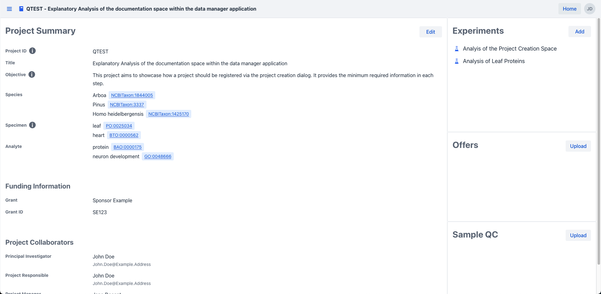
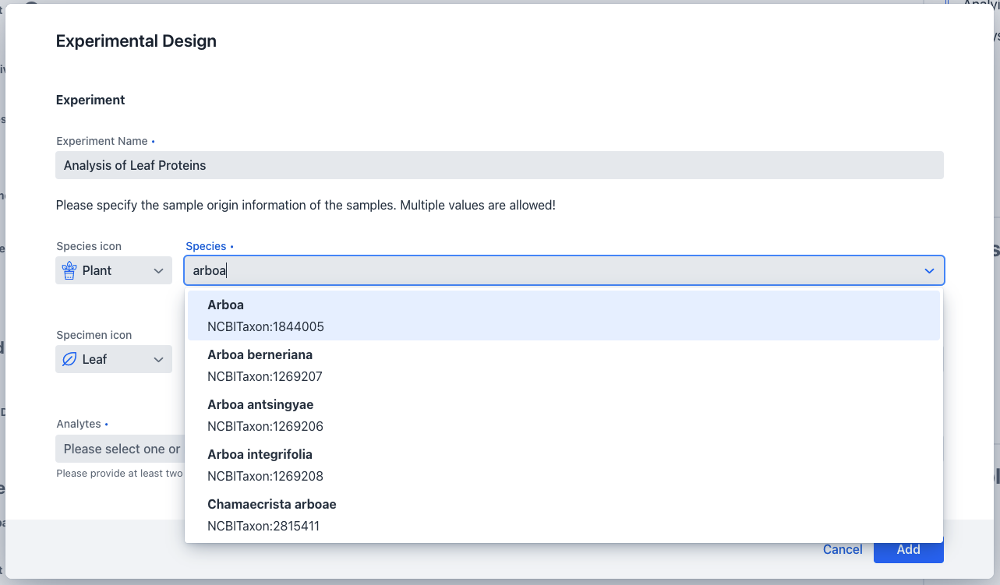
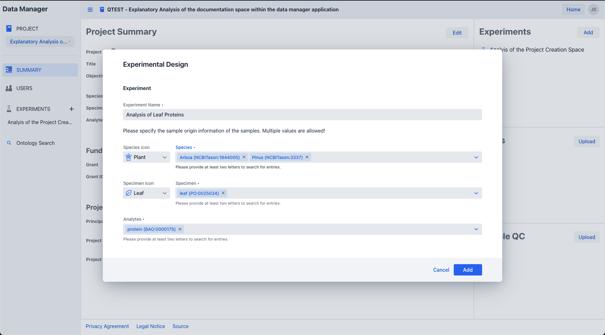
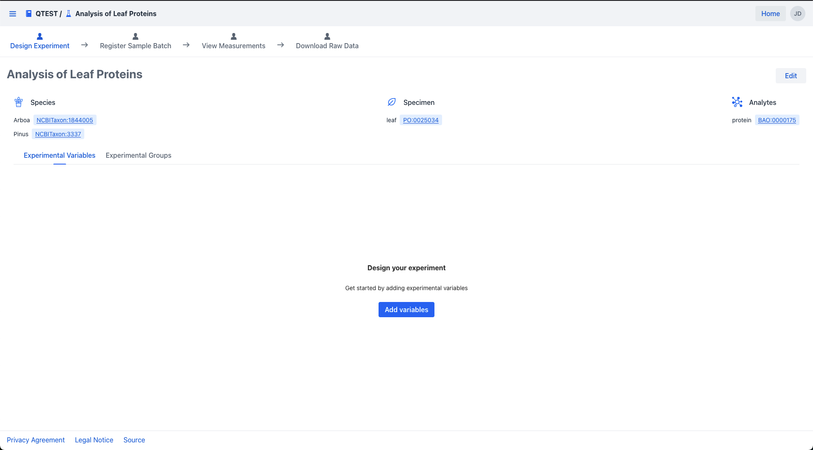
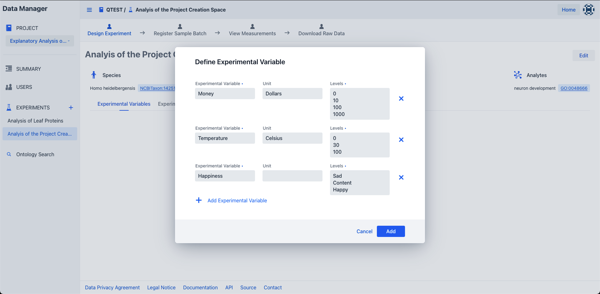
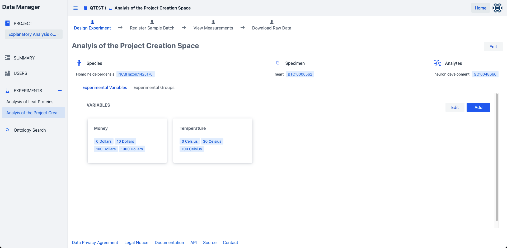
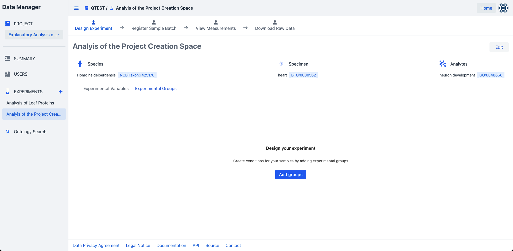
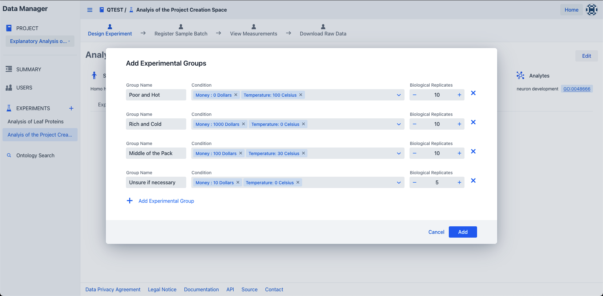
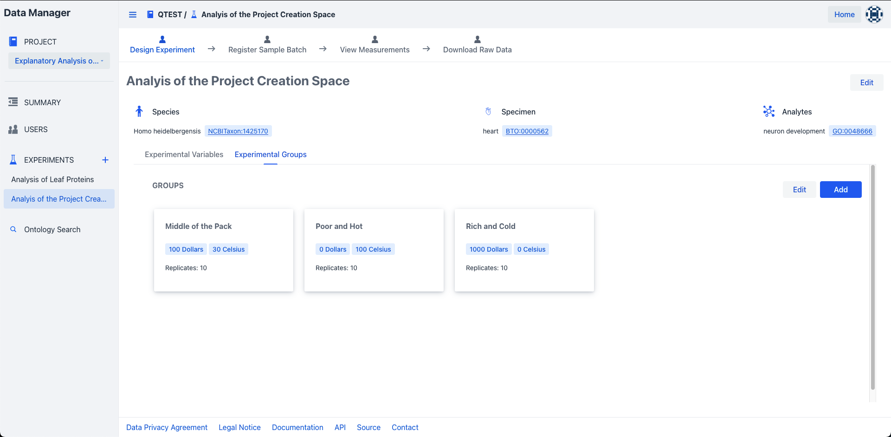

# Create an experiment

[Navigate](../project/project_introduction.md#find-and-open-a-project) to the project summary. Click the **add** button in the experiment section (top right).

{.screenshot}

!!! info "Required role"
    You need **write** or **admin** role to create experiments.

In the dialog, provide:

- **Experiment name** — unique within the project, easy to identify
- **Species** — the organism(s) your samples come from (type at least 2 characters to search)
- **Specimen** — the biological material type (e.g. blood, liver tissue)
- **Analyte** — the molecular class being measured (e.g. protein, mRNA)

You can select multiple entries per field. Optionally choose an icon for the species and specimen.

{.screenshot}

Click **Add**.

{.screenshot}

## Define experimental variables

Experimental variables are the conditions you're testing — drug concentration, temperature, time point, and so on. They're the building blocks of your experimental groups.

In the experiment summary, select the **Experimental Variables** tab and click **Add variables**.

{.screenshot}

!!! info "Required role"
    You need **write** or **admin** role.

For each variable, provide:

- **Name** — e.g. `Temperature`
- **Levels** — the values it can take: e.g. `0`, `10`, `100`
- **Unit** *(optional)* — e.g. `°C`

{.screenshot}

Click **Add** to save. To edit later, click **edit** in the tab and then **Save**.

{.screenshot}

!!! warning "Variables are locked once groups exist"
    Delete all experimental groups before editing variables.

## Define experimental groups

Groups represent unique combinations of variable levels — the distinct conditions your samples experienced. Each group holds a set of biological replicates.

Select the **Experimental Groups** tab and click **Add groups**.

{.screenshot}

For each group, select the variable levels that define its condition and enter the number of biological replicates.

{.screenshot}

Click **Add** to save.

{.screenshot}

!!! warning "Groups are locked once samples are registered"
    Remove all registered samples before editing groups.

---

## What's next

➡ [Register sample batches](../batch/sample-batch.md) · [Define confounding variables](confounding-variables.md)
