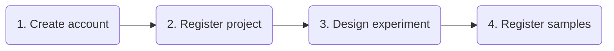
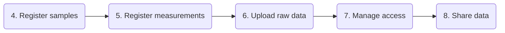

# Process overview

Here's the complete Data Manager workflow — from creating your account to sharing data with collaborators.

## Step by step

### 1. Create your account

Register a free Data Manager account using your ORCID (recommended) or email address. ORCID is a free, permanent researcher identifier — linking it means one fewer password to remember.

➡ [Register your account](../user/user_registration.md)

### 2. Register a project

A project is the top-level container for your research — it holds experiments, samples, measurements, and data files in one place. You'll provide a title, objective, contacts, and funding details.

➡ [Register a project](../project/project_registration.md)

### 3. Design your experiment

Define the biological design of your study: which organisms, tissues, and analytes you're working with, and what experimental conditions you're testing.

➡ [Create an experiment](../experiment/experiment_creation.md)

!!! tip "Track confounding variables"
    Factors you didn't control — like sample collection time or operator — can be recorded as [confounding variables](../experiment/confounding-variables.md) so you can account for them during analysis.

### 4. Register your samples

Samples are registered in groups called **batches** — the set of samples shipped together to a measurement facility. Download the Excel template, fill in your sample metadata, and upload it.

➡ [Register a sample batch](../batch/sample-batch.md)

### 5. Register your measurements

After your samples have been measured, record what was done: which instrument, which protocol, and other domain-specific details. Each measurement gets a unique identifier that links back to its sample.

➡ [Register measurements](../measurement/measurement_registration.md)

### 6. Upload your raw data

Transfer instrument output files to the QBiC upload server via SFTP. Each file gets linked to its measurement record.

!!! info "External collaborators"
    Uploading from outside the University of Tübingen network? [Request server access](../rawdata/raw_data_request_server_access.md) first.

➡ [Upload raw data](../rawdata/raw_data_upload.md)

### 7. Manage project access

Invite collaborators and assign roles — viewer, writer, or admin — to control who can see and edit your data.

➡ [Manage access](../project/project_access.md)

### 8. Share your data

Generate download URLs so collaborators or reviewers can retrieve your raw data files directly.

➡ [Download data](../rawdata/raw_data_download.md)

---

## Need help?

Contact the QBiC support team at [support@qbic.zendesk.com](mailto:support@qbic.zendesk.com).
