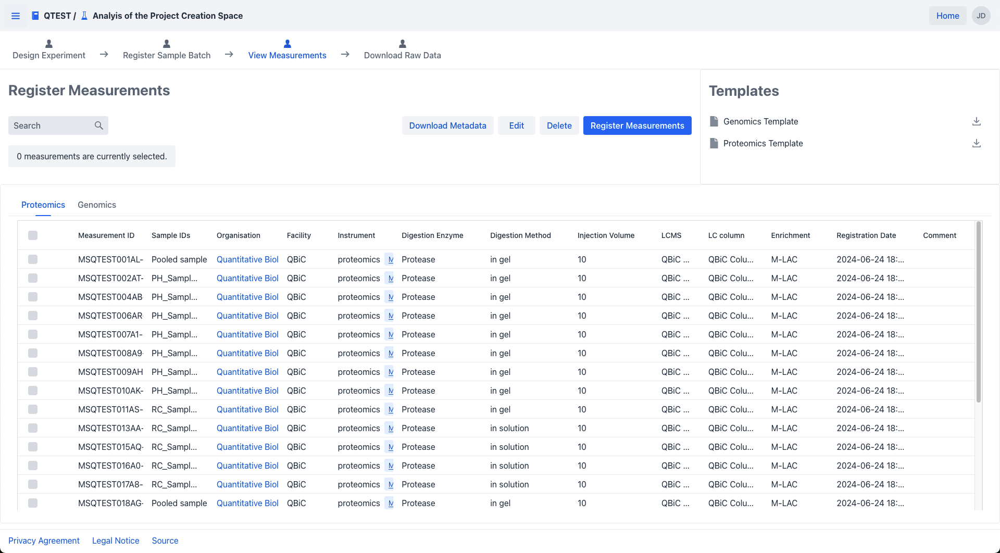
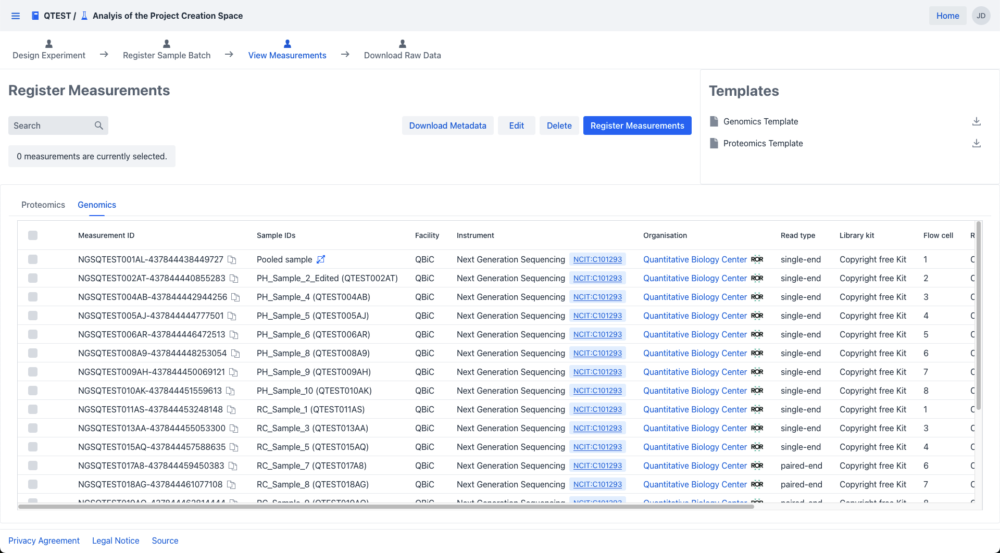
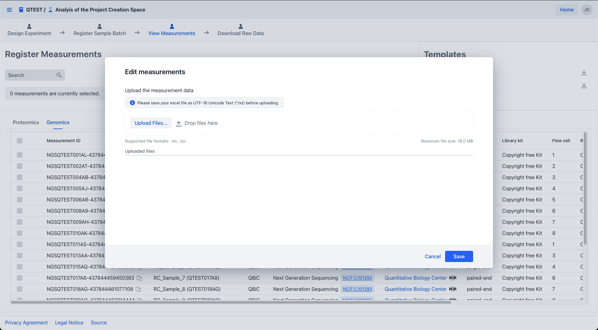
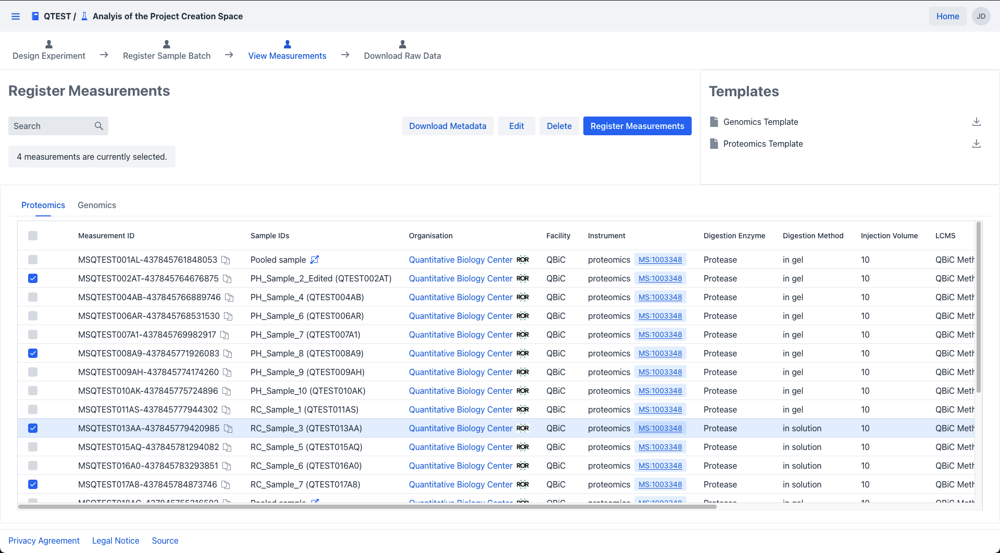
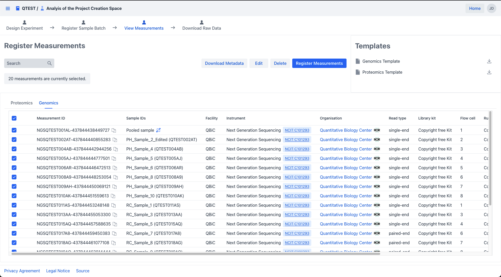
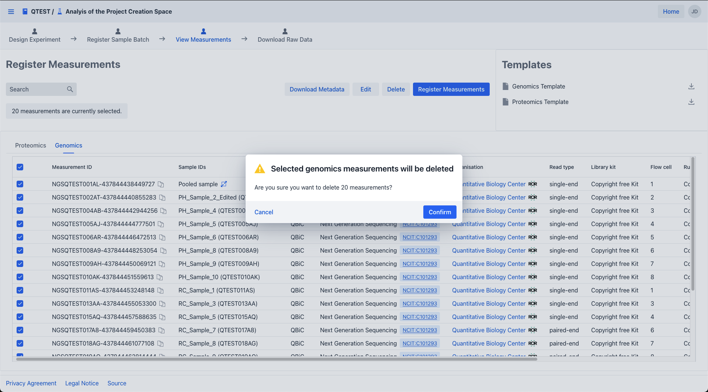

# Edit measurements

!!! tip "Excel is supported"
    Upload edited metadata as an Excel file (`.xlsx`). Metadata must be on the first sheet.

!!! tip "Adding new measurements?"
    See [Register measurements](measurement_registration.md) instead.

[Navigate](measurement_introduction.md#navigate-to-measurements) to the measurement summary.

!!! info "Required role"
    You need **write** or **admin** role to edit or delete measurements.

## Edit measurement metadata

1. Select the domain tab (Proteomics or Genomics).

2. Click **Download Metadata** to get the current metadata as `.xlsx`.

=== "Proteomics"

    {.screenshot}

=== "Genomics"

    {.screenshot}

3. Open the file and make your changes. Grey columns (e.g. `Measurement Id`) are locked — changes there are ignored.

    !!! warning "Locked fields"
        To correct a locked field, [delete the measurement](#delete-measurements) and [re-register it](measurement_registration.md).

4. Save the file. You can upload the `.xlsx` directly or export as tab-separated UTF-16BE text.

5. Click **Edit** in the measurement summary to open the upload dialog.

    {.screenshot}

6. Upload your file. The dialog validates it and highlights errors.

    !!! warning "File requirements"
        `.xlsx`, `.txt`, or `.tsv`. Maximum 16 MB.

7. Click **Save**.

## Delete measurements

1. In the measurement summary, select the measurements to delete by clicking their checkboxes. Use the header checkbox to select all in a domain tab.

    {.screenshot}

    {.screenshot}

    !!! note "Domain-specific selection"
        Selections reset when you switch domain tabs. Delete measurements for each domain separately.

2. Click **Delete**. A confirmation dialog shows the count and domain.

    {.screenshot}

3. Click **Confirm**.

!!! warning "Raw data must be removed first"
    Measurements with attached raw data cannot be deleted. Delete the raw data first.

---

## What's next

➡ [Upload raw data](../rawdata/raw_data_upload.md)
