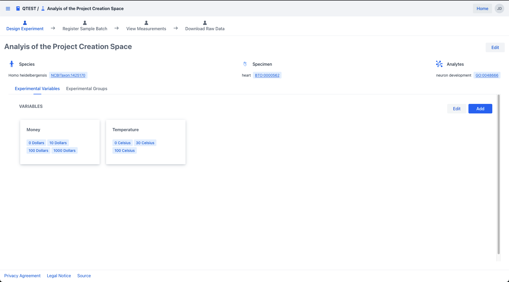
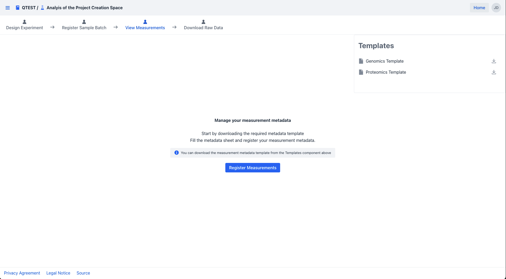

# Measurements

A measurement records how a sample was analysed: which instrument, which protocol, and where the work was done. Registering measurements creates the link between your biological samples and the raw data files produced by the instrument.

The Data Manager supports two measurement domains:

- **Proteomics** — mass spectrometry, measurement IDs prefixed with `MS`
- **Genomics** — next-generation sequencing, measurement IDs prefixed with `NGS`

## Navigate to measurements

[Navigate](../project/project_introduction.md#find-and-open-a-project) to your project, then [open the experiment](../experiment/experiment_introduction.md#find-and-open-an-experiment). Click the **View Measurements** tab.

{.screenshot}

This opens the measurement summary view with separate tabs for Proteomics and Genomics.

{.screenshot}

---

## What's next

➡ [Register measurements](measurement_registration.md)
