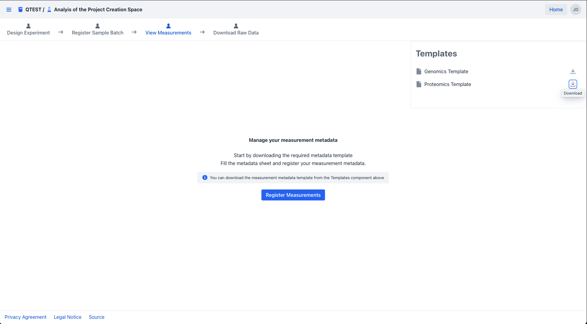
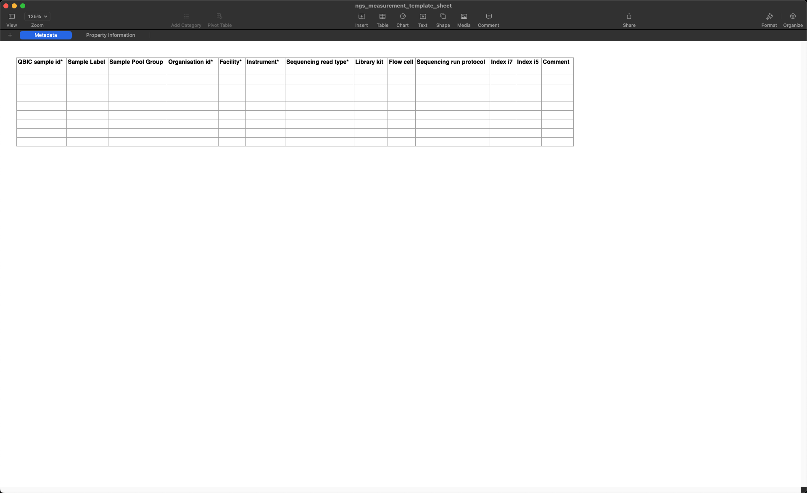
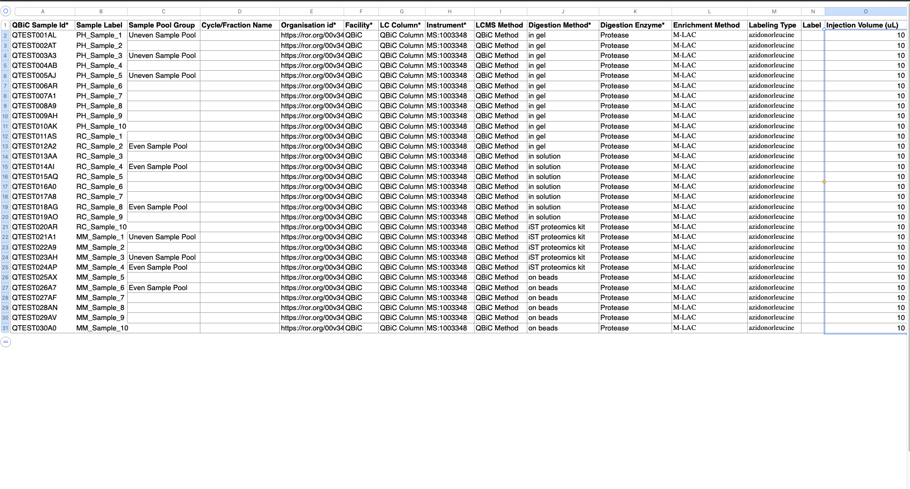
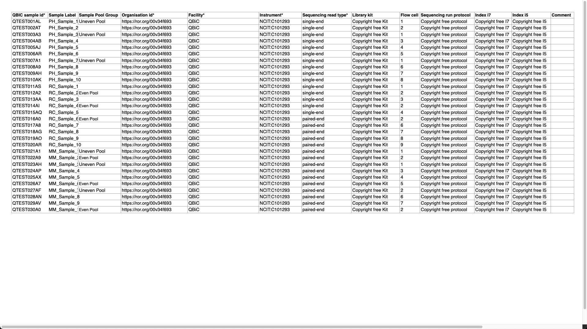
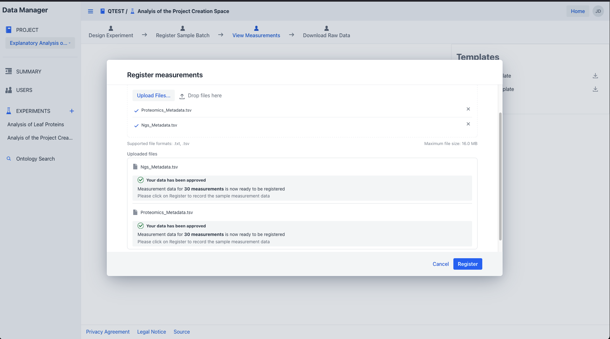
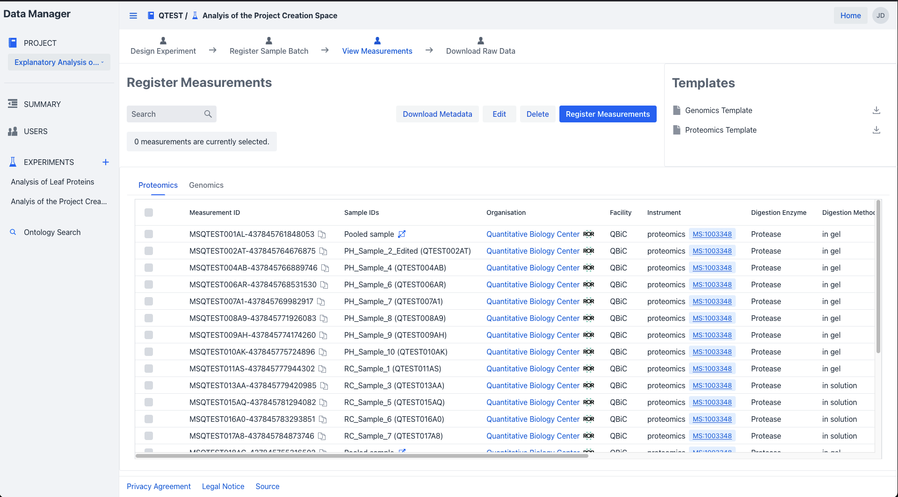

# Register measurements

!!! tip "Excel is supported"
    Upload measurement metadata as an Excel file (`.xlsx`). Metadata must be on the first sheet of the workbook.

[Navigate](measurement_introduction.md#navigate-to-measurements) to the measurement summary.

Register measurements in three steps:

1. [Download the template](#download-template)
2. [Fill in the metadata](#prepare-metadata)
3. [Upload the completed file](#upload)

!!! info "Required role"
    You need **write** or **admin** role to see the registration buttons.

## Download template

=== "Proteomics"

    Click the download icon (↓) in the template section (top right).

    {.screenshot}

=== "Genomics"

    Click the download icon (↓) in the template section (top right).

    {.screenshot}

## Prepare metadata

The template has two sheets: **Property Information** (reference) and **Metadata** (fill this in). Mandatory columns are marked with `*`.

=== "Proteomics"

    Key fields:

    - **Sample ID** — copy from your [batch metadata download](../batch/sample-batch.md#download-sample-metadata)
    - **Instrument** — an ontology code (CURIE) for your mass spectrometer, e.g. `BAO:0002733`. Use the [ontology search](../ontology_search/ontology_search_introduction.md) to find the right code.
    - **Organisation Id** — the full [ROR](https://ror.org/) URL of your institution, e.g. `https://ror.org/03a1kwz48`. Search at [ror.org](https://ror.org/search).
    - **Digestion enzyme**, **Digestion method**, **LC column** — required proteomics-specific fields.

    {.screenshot}

=== "Genomics"

    Key fields:

    - **Sample ID** — copy from your [batch metadata download](../batch/sample-batch.md#download-sample-metadata)
    - **Instrument** — an ontology code (CURIE) for your sequencer, e.g. `OBI:0002750`. Use the [ontology search](../ontology_search/ontology_search_introduction.md) to find the right code.
    - **Organisation Id** — the full [ROR](https://ror.org/) URL of your institution.
    - **Read type** — `paired-end` or `single-end`.
    - **Index I7 / I5** — required for pooled (multiplexed) measurements. These are the DNA index sequences used to identify which sample is which when multiple libraries are sequenced together.

    {.screenshot}

??? info "What is a CURIE?"
    A CURIE (Compact URI) is a short, standardised code that identifies a specific term in a scientific database — for example, `OBI:0002750` for an Illumina sequencer. The format follows the [W3C CURIE Syntax](https://www.w3.org/TR/curie/): `PREFIX:REFERENCE`. You don't need to memorise these. Search by instrument name using the [ontology search](../ontology_search/ontology_search_introduction.md) and copy the code.

!!! tip "XLSX vs TSV"
    You can upload `.xlsx` directly (recommended) or export the Metadata sheet as a tab-separated `.txt` file in **UTF-16BE Unicode Text** encoding. UTF-16BE preserves special characters like `μ`. A different encoding will corrupt them.

## Upload

1. Click **Register Measurements**.

    {.screenshot}

2. Drag and drop your file or click **Upload files**.

    {.screenshot}

    !!! warning "File requirements"
        `.xlsx`, `.txt`, or `.tsv`. Maximum 16 MB.

3. The dialog validates your file and flags any errors.

4. Click **Register**.

??? info "Measurement ID format"
    Each measurement gets a unique ID that encodes its provenance: `[DOMAIN][SAMPLE_ID]-[TIMESTAMP]`. For example, `MSQ2ABCD001AA-118569093700875` (proteomics) or `NGSQ2ABCD001AA-118569093700875` (genomics). The embedded sample ID means you can always trace a measurement back to its source sample.

Registered measurements appear in the domain-specific tab.

{.screenshot}

## Download measurement metadata

Click **Download Metadata** to export the metadata for all measurements in the currently selected tab as an `.xlsx` file.

---

## What's next

➡ [Upload raw data](../rawdata/raw_data_upload.md) · [Edit measurements](measurement_edit.md)
