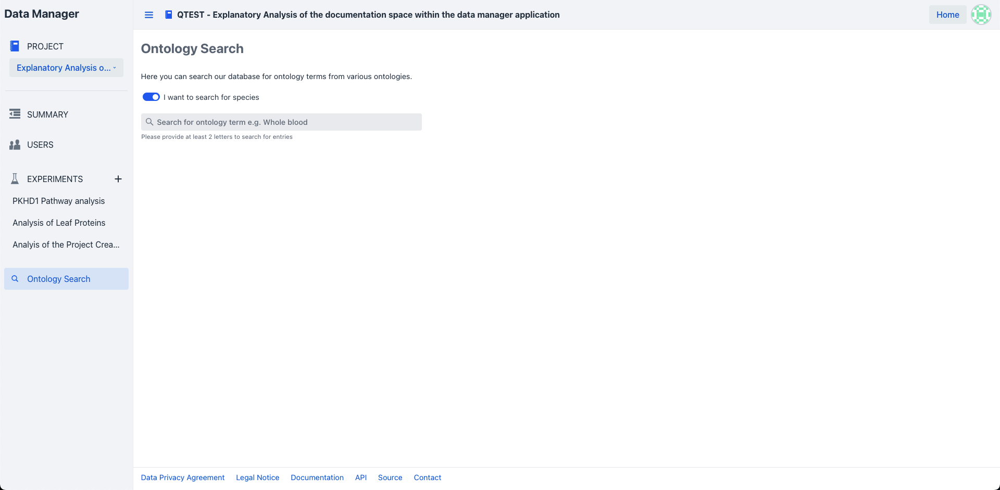
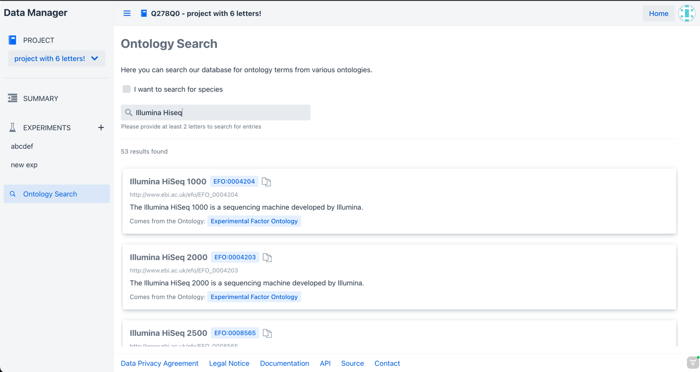
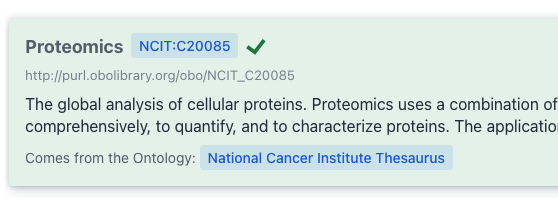

# Ontology Search Introduction

The ontology search functionality can be accessed from within a project via the application drawer.
Therefore, start by [navigating](#ontology-navigation) to the ontology summary view.

The ontology search allows you to [search](#ontology-search) for ontology information
within our database.

## Ontology Navigation

From the landing page you can navigate into a project via the project list by clicking on the
project card directly.

Once within the project open the application drawer via the button on the top left of the
application
and select "ontology search" to navigate to the ontology summary view.

## Ontology Search

Start by providing at least 2 letters in the ontology search field of the entity for which you want
to retrieve the ontology information.
Once done so a card list showing information for all ontology entries which contain the provided
letters will appear.

!!! note "Enable species search"
    The application provides access to species terminologies for the
    complete [tree of life](https://www.ncbi.nlm.nih.gov/taxonomy) provided by NCBI.
    If activated, only the species taxonomy is queried. 

??? note "Why does the search not include species?" 
    We currently host our own database instance for efficient queries of species to support
    faster lookups. Also, the TIB terminology service, which we have integrated for all other term lookups,
    does not provide the tree of life, yet.
    So they are two independent systems that we request information from here.

Additionally, it allows you to copy the
ontology [CURIE](https://link.springer.com/article/10.1007/s12599-022-00744-0),
which can be especially handy
during [measurement registration](../measurement/measurement_registration.md)

