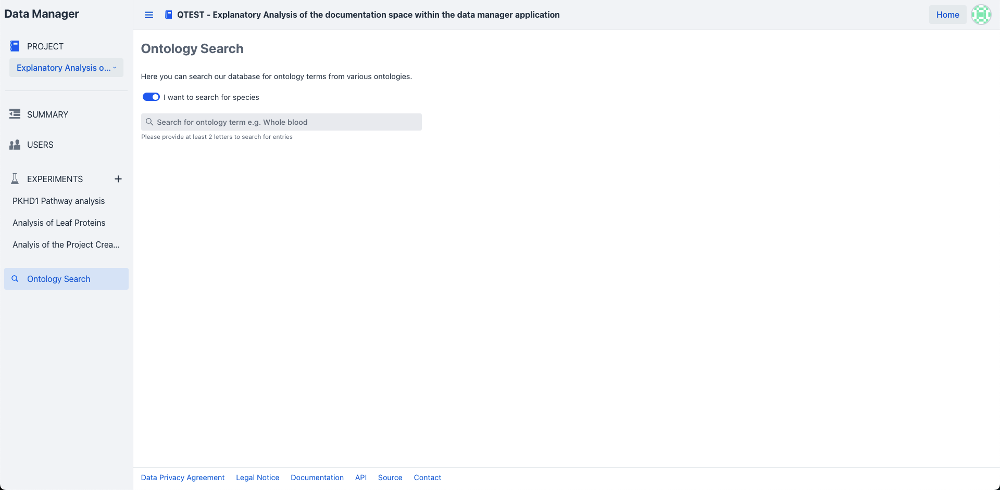
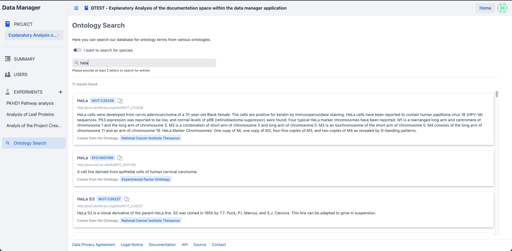
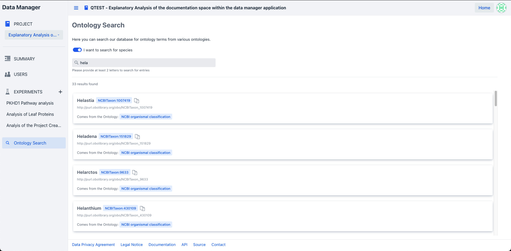
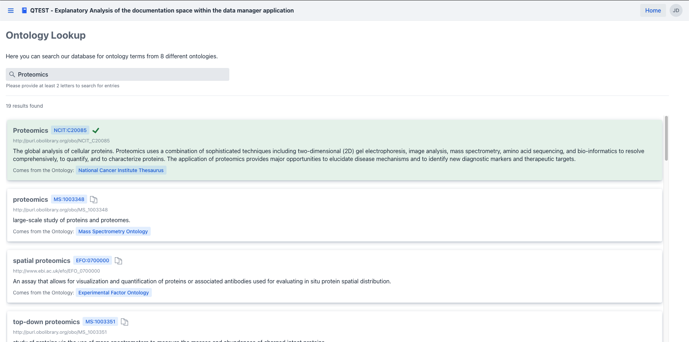

# Ontology search

The ontology search helps you find standardised scientific terms — and their unique codes — for use in experiment and measurement registration.

**What's an ontology?** A shared scientific dictionary: an agreed list of terms with unique identifiers, maintained by the research community. Using these terms means your data can be understood and compared by anyone.

## Navigate to the search

From any project view, open the application drawer (top left) and select **Ontology search**.

{.screenshot}

## Search for a term

Type at least 2 characters in the search field. A list of matching terms appears with their names, descriptions, and identifiers.

{.screenshot}

### Species-only search

Toggle the species filter to search only the [NCBI taxonomy](https://www.ncbi.nlm.nih.gov/taxonomy) (the complete tree of life).

{.screenshot}

!!! note "Why a separate species search?"
    Species terms come from NCBI's taxonomy database, which is hosted separately from the [TIB Terminology Service](https://terminology.tib.eu) used for other ontologies. The two systems are queried independently.

## Copy a CURIE

Click the copy icon next to any term to copy its CURIE (e.g. `NCIT:C105979`) to your clipboard. Particularly useful when filling in [measurement registration templates](../measurement/measurement_registration.md).

{.screenshot}

---

## What's next

➡ [Register measurements](../measurement/measurement_registration.md) · [Create an experiment](../experiment/experiment_creation.md)
