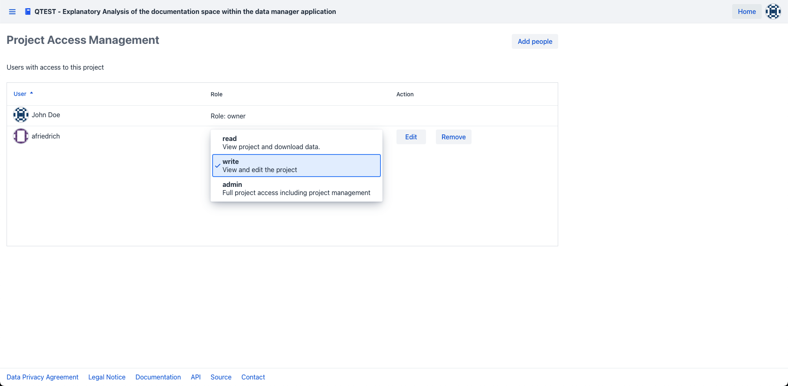

# Project Access Management

Start by [navigating](project_introduction#project-navigation) to the project summary view of your project of interest.
From there, switch to the access management view by clicking on the "users" tab in the application drawer 

!!! info "Admin privileges"
You need to have a project role of "owner" or "admin" to see the users tab and access the project access view.   

Within the project access view a table shows the username of all accounts currently having access to their project and their respective roles

Additionally, this view enables you to specify which users have access to your project and fine-tune the kind of permissions you want to grant the users.

1. [Add collaborators to your project](#add-collaborator)
2. [Change the project role of collaborators within your project](#change-project-role)
3. [Remove collaborators from your project](#remove-collaborator)

## Add Collaborator

To add a collaborator to your project press the "add people" button on the top right of the project access view which will open the "add collaborator" dialog

Within this dialog you can select the user you want to grant access in the select person section via their respective username.

Afterward, you need to specify the kind of access the added collaborator should have to the project. 
Do so by clicking on the relevant radio button in the "Assign a role" section of the dialog.

!!! warning "Admin privileges"
Keep in mind that a user that you grant admin privileges to your project can add and remove other collaborators to your project.   

Finally click on the "Confirm" button to add your collaborator with the chosen role to the project.

!!! info "Email notification"
Once a user has been added to your project, the email address linked to the username will receive an email with a link to the project he has been added to.

## Change Project Role

To change the project role of a project collaborator press the edit button in the action column next to the user within the table.

This will make the role of the user selectable in the role column of the access table

Click on the selection box within the role column to open up the possible selections for the user in question and select the role you want to grant to the collaborator.

This will change the user to the newly selected role for your project and close the selection within the role column.

!!! info "project owner"
The project owner is always the user registering the project for the first time. 
The project owner cannot be removed from the project and his role cannot be changed.

## Remove Collaborator
To remove a collaborator press the cross icon next to the collaborator in question.

Once pressed the collaborator will be removed from the project.

