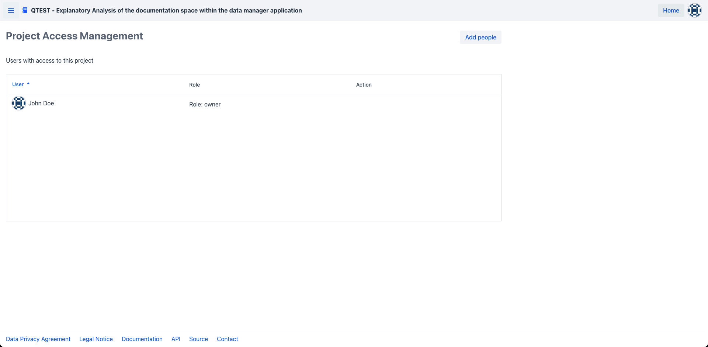
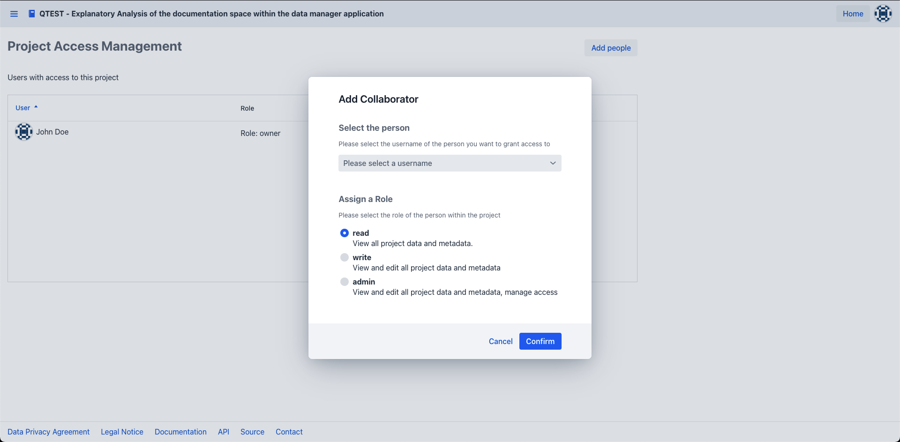
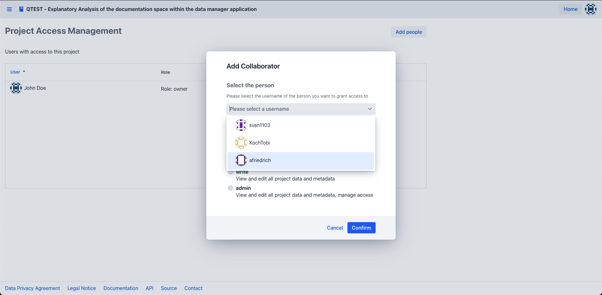
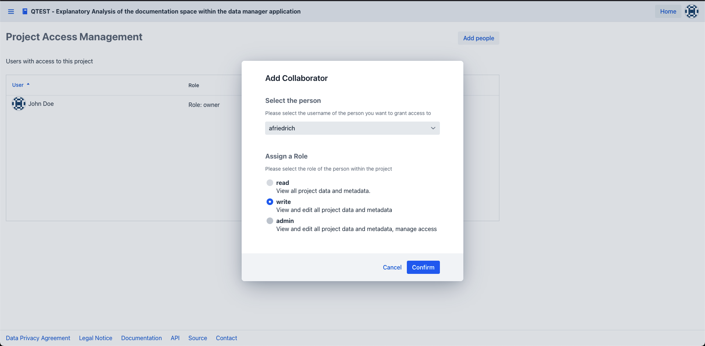
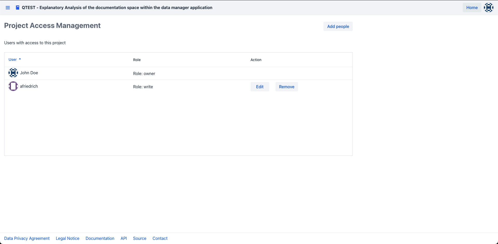
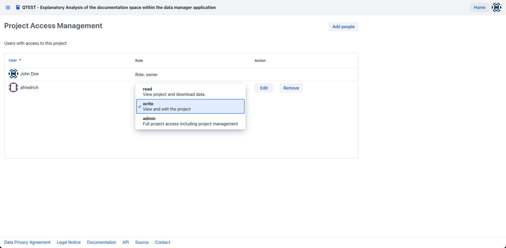

# Manage project access

Control who can view or modify your project by assigning roles.

!!! info "Required role"
    You need **owner** or **admin** role to manage access.

## Open the access view

[Navigate](project_introduction.md#find-and-open-a-project) to the project summary. Open the application drawer and click the **Users** tab.

{.screenshot}

The access view lists all users and their roles.

{.screenshot}

## Add a collaborator

1. Click **Add people** (top right).

    {.screenshot}

2. Search by username and select the person.

    {.screenshot}

3. Choose a role: **read**, **write**, or **admin**.

    {.screenshot}

    !!! warning "Admin role"
        Admin users can add and remove other collaborators.

4. Click **Confirm**.

    {.screenshot}

!!! info "Email notification"
    The new collaborator receives an email with a direct link to the project.

## Change a role

Click the **edit** button next to the user, select the new role from the dropdown, and the change applies immediately.

{.screenshot}

!!! info "Project owner"
    The owner role is assigned to whoever created the project. It cannot be changed or removed.

## Remove a collaborator

Click the **×** icon next to the collaborator. They lose access immediately.

---

## What's next

➡ [Design your experiment](../experiment/experiment_introduction.md)
