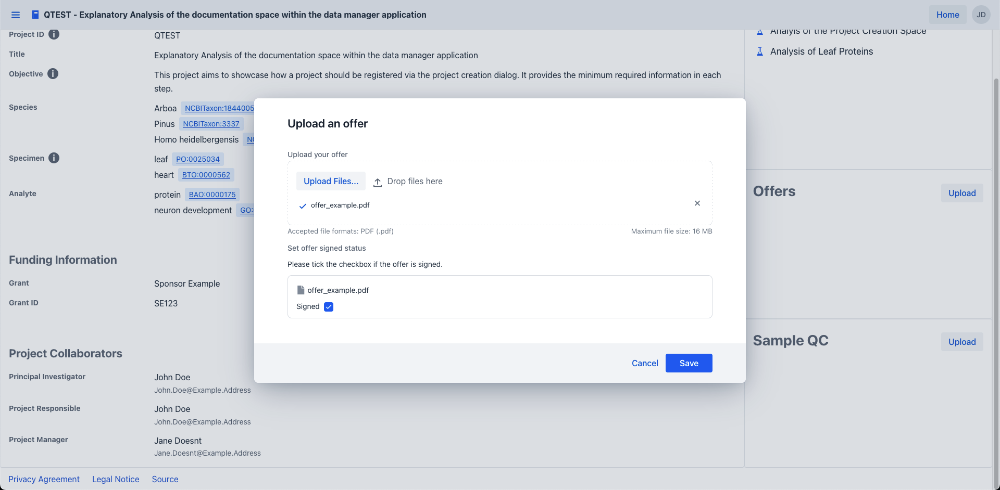
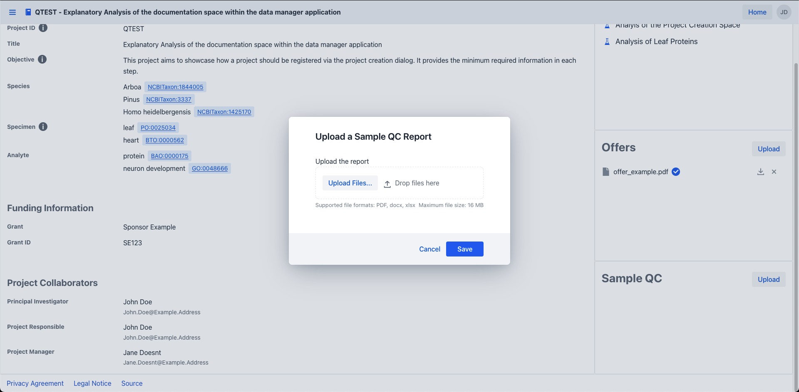

# Project Editing

Start by [navigating](project_introduction.md#project-navigation) to the project summary view of your project of interest.

!!! info "Project access"
    Should you not see your project of interest, 
    please make sure that you have been granted access to it by the project owner

Within the project summary view, press the edit button on the top right to open up the edit dialog for your project.

!!! info "Project role"
Should you not see the edit button,
please make sure that you have been granted the "write" or "admin" role to it by the project owner/admin!

Once the dialog has been opened you can edit the project attributes of interest 
within the dialog and save your changes via the "save" button on the bottom.

# Upload of Project Related Files

After successful project creation, navigate into your project of interest as outlined in
[project navigation](project_introduction.md#project-navigation).

Within the project summary view, you are able to upload project related files such as the offer or quality control reports,
via their respective upload buttons to the right.

!!! info "Project role"
Should you not see the upload button,
please make sure that you have been granted the "write" or "admin" role to it by the project owner/admin!

## Offer Upload

To upload one or more offer files click the upload button within the offer component in the middle right of the project summary view, 
which will open up the offer upload dialog.

Within the dialog you are able to upload your offer files either via clicking the upload files button and selecting the files of interest in your file system 
or by drag and dropping the files into the dashed box saying "drop your files here".

Should you have uploaded one or more wrong files, 
you can easily delete them via a press of the cross icon next to the respective file names

!!! warning "File constraints"
Please adhere to the file format and maximum file size outlined in the dialog.
Currently, an offer file has to be in the PDF file format with a maximum file size of 16Mb

For each successful file upload you are then able to specify if the offer was signed already 
via the checkbox shown next to the file name.

Finally, save your uploaded files to the project via a pressing the "Save" button on the bottom right of the dialog. 
Your uploaded offer will then be shown in the offer component on the middle right of the project summary view.

## Quality Control Upload

To upload one or more quality control(qc) files click the upload button within the quality control component in the bottom right of the project summary view, 
which will open up the QC upload dialog.

Within the dialog you are able to upload your qc files either via clicking the upload files button and selecting the files of interest in your file system
or by drag and dropping the files into the dashed box saying "drop your files here".

Should you have uploaded one or more wrong files,
you can easily delete them via a press of the cross icon next to their respective file names

!!! warning "File constraints"
Please adhere to the file format and maximum file size outlined in the dialog.
Currently, a qc file has to be in the PDF, docx, or xlsx file format with a maximum file size of 16Mb

For each successful qc file upload you are then able to optionally link it to the experiment in question 
within the link to an experiment section of the dialog.
To do so, select the experiment linked to their respective quality control files via the combobox below the file name.

Finally, save your uploaded files to the project via a pressing the save button on the bottom right of the dialog.
Your uploaded qc reports will then be shown in the qc component on the bottom right of the project summary view.

