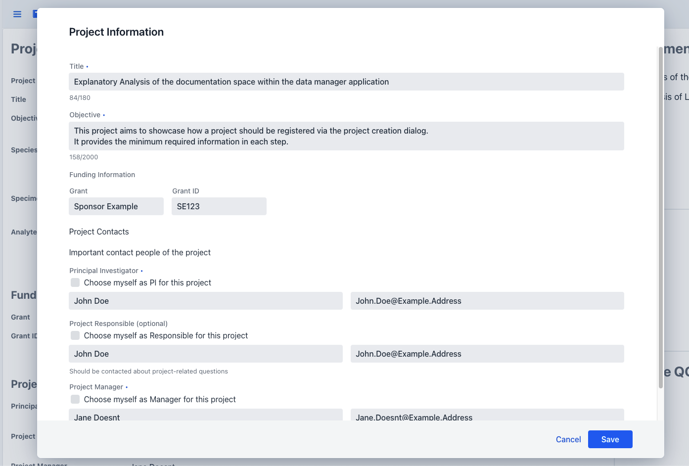
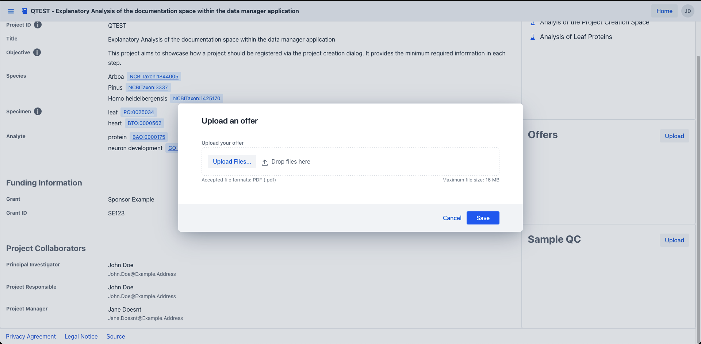
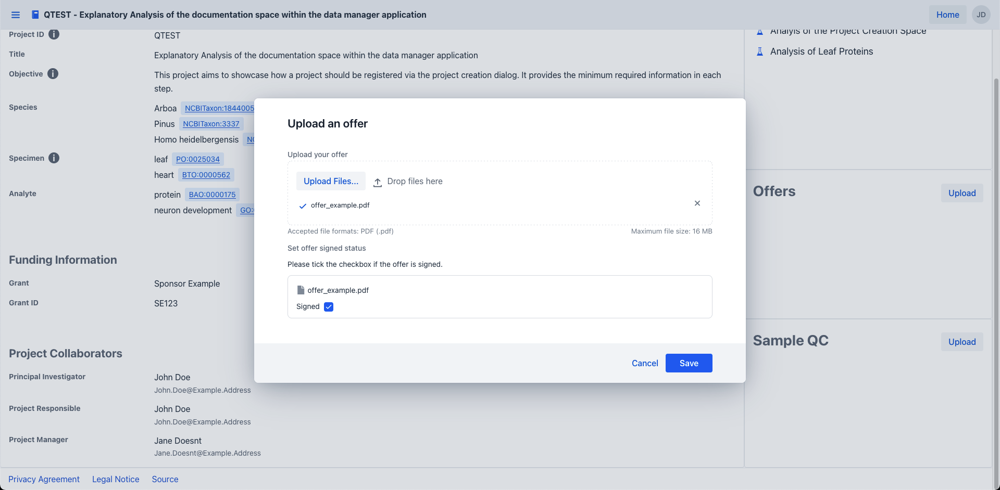
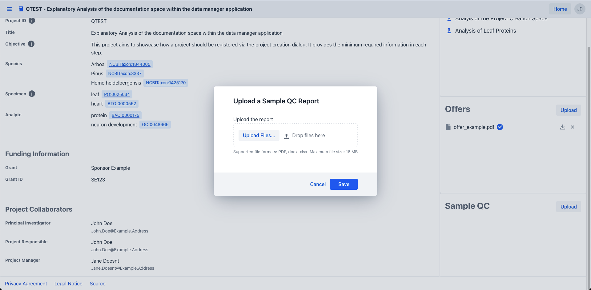
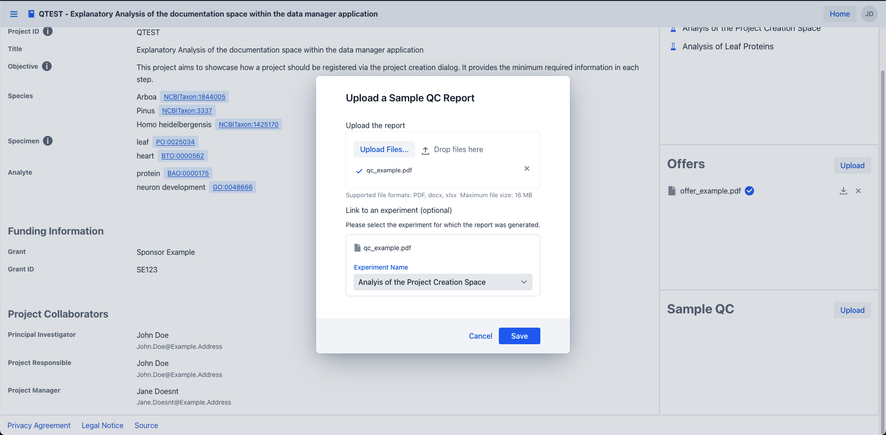
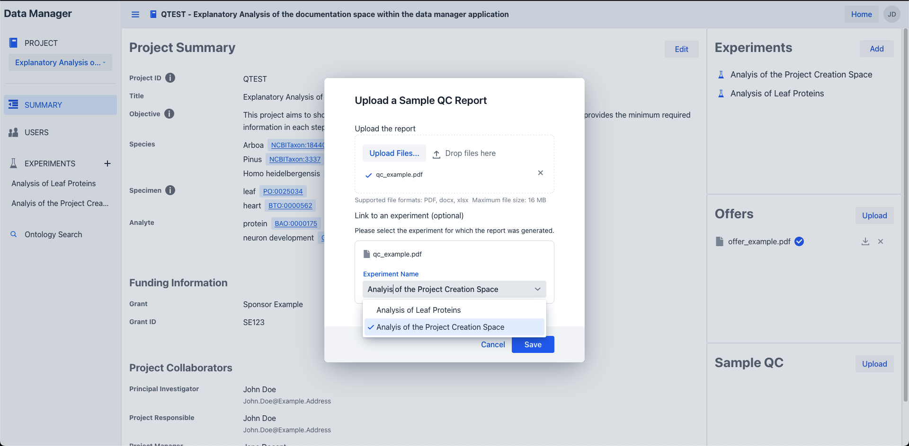

# Edit a project

Update project details, attach supporting documents, or export metadata.

!!! info "Required role"
    You need **write** or **admin** role to edit. If the edit button isn't visible, ask the project owner to update your role.

## Edit project details

[Navigate](project_introduction.md#find-and-open-a-project) to the project summary. Click the **edit** button (top right), update the fields, and click **Save**.

{.screenshot}

## Upload project-related files

### Offer upload

1. Click the upload button in the **Offer** section of the project summary.

    {.screenshot}

2. Drag and drop your file or click **Upload files** to browse.

    {.screenshot}

3. Tick **Signed** if the offer has been countersigned.

    {.screenshot}

4. Click **Save**.

!!! warning "File requirements"
    PDF only. Maximum 16 MB.

### Quality control upload

1. Click the upload button in the **Quality Control** section.

    {.screenshot}

2. Drag and drop or click **Upload files**.

    {.screenshot}

3. Optionally link the report to an experiment using the dropdown.

    {.screenshot}

4. Click **Save**.

!!! warning "File requirements"
    PDF, DOCX, or XLSX. Maximum 16 MB.

## Download project metadata

Export your project metadata as an [RO-Crate](https://www.researchobject.org/ro-crate/) — a structured, machine-readable package that bundles your metadata in a format other systems can understand.

Click **Export as RO-Crate** in the project summary. A `.zip` archive downloads to your computer.

---

## What's next

➡ [Manage project access](project_access.md)
