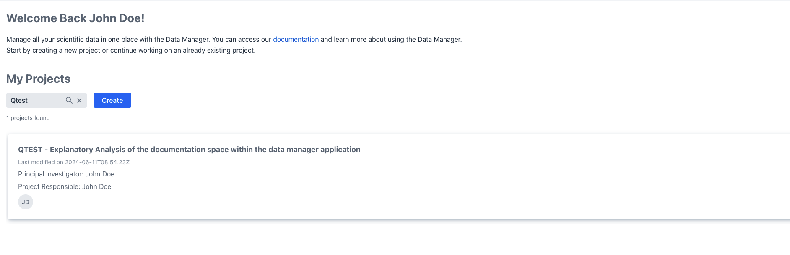

# Project Introduction

After a successful login you will be redirected to your personal landing page.
From there, you can either [navigate](#project-navigation) into your project of interest
or [register a new project](project_registration.md).

!!! info "project access"
    Should you not see your project of interest, 
    please make sure that you have been granted access to it by the project owner

## Project Navigation

From the landing page you can navigate into your project via the project list.
Either click on the project card directly or make use of the search box
to filter the project lists for the project of interest.

Once you've found the project you can navigate into it
by clicking on its respective project card, which will take you into the project summary view.

