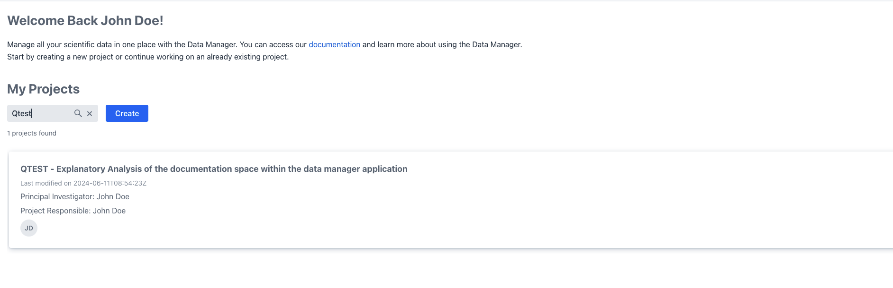
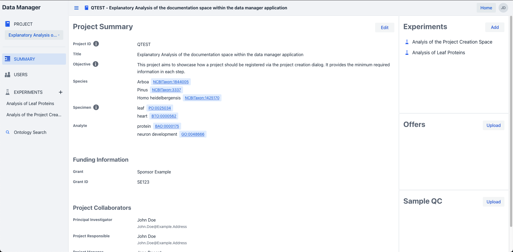
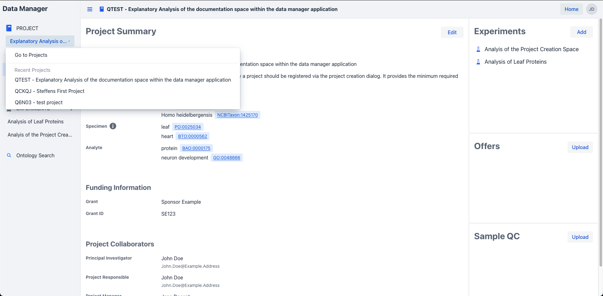

# Projects

A project is the top-level container in the Data Manager. It holds everything related to one research study — experiments, samples, measurements, and raw data — all linked together and searchable.

After logging in, your landing page shows all projects you have access to.

## Find and open a project

Scroll through the project list or type into the search box to filter by name or code.

{.screenshot}

Click a project card to open the **project summary view**.

{.screenshot}

!!! info "Can't find your project?"
    Ask the project owner to [grant you access](project_access.md).

## Navigate between projects

**Home button** (top right): Returns you to the project list.

**Application drawer** (top left): Lists your recent projects and experiments. Open it with the menu button.

{.screenshot}

Select a project from the drawer to jump straight to it, or click **Go to projects** to return to the full list.

{.screenshot}

!!! info "Application drawer"
    The drawer also lets you switch between experiments within a project without going back to the project summary.

---

## What's next

➡ [Register a new project](project_registration.md) · [Edit project details](project_edit.md) · [Manage access](project_access.md)
