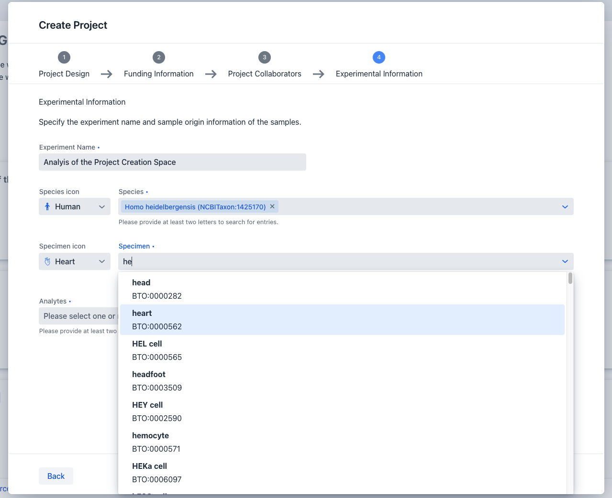
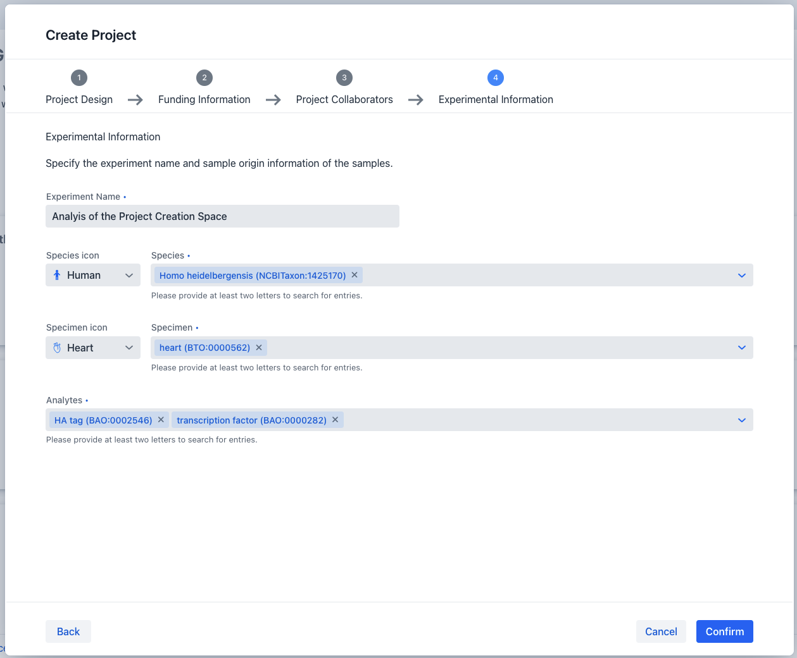

# Project Registration

To register a new project the following steps have to be taken:

1. Trigger the project creation dialog
2. Provide the minimal required information for the following steps within the dialog:
    1. [Project Design](#project-design)
    2. [Funding Information (Optional)](#funding-information)
    3. [Project Collaborators](#project-collaborators)
    4. [Experimental Information](#experimental-information)

You can start the project registration process by clicking the create button on top of your project list within your personal landing page.
This will open the project registration dialog which will guide you through the individual steps necessary to successfully register a new project.

Following is a detailed guide for each of these steps:

## Project Design

The information provided in this step serves as the basic outline of your project.

Therefore, it is mandatory that you provide a concise project title and project description in
this step.
!!! info "project code"
    Each created project will be assigned a unique 5 letter project code, distinguishing it from other projects within the system.

Once all the required information has been provided you can navigate to the next step via the "next"
button below

## Funding Information

In this step provide the grant label and identifier if your project has been funded by a third party
sponsor.
If this is not applicable for your project, you can go directly to the next step via the "next"
button below. If you want change any adde information, previous steps in the dialog can always be reached by clicking the "back" button.

## Project Collaborators

In this step you are able to specify the collaborating parties associated with your project.
The minimum required information consists of declaring the name and email address of the principal
investigator
instigating the project and the project manager handling the projects' execution.
Finally, you can optionally define the name and email address of the responsible party, which should
be contacted should project specific questions arise.
For each of these roles you can of course also assign yourself via a press of the checkbox above
each role.

Once all the required information has been provided you can navigate to the next step via the "next"
button below
or go to the previous step via the "back button".

## Experimental Information

The final step during project creation consists of creating the basic outline of your first
experiment
associated with your project.
For this you need to specify the name of the experiment, and species, specimen and analyte
information of the involved organisms.
To provide these details you can select one or more entries via the provided combo boxes.
Start by providing at least 2 letters of your species, specimen or analyte in their respective inputs
fields and possible selection options will appear.

!!! info "ontology id"
    Behind each selectable options within the species, specimen and analyte input fields
    is the unique ontology identifier from the providing ontology.

Once all the required information has been provided you can create your project via the "confirm"
button below or go to the previous step via the "back button".

After successful project creation, your project should appear in the project listing on your landing
page.
To navigate into your project, you can follow the steps outlined
in [project navigation](project_introduction.md#project-navigation)

Finally, after successful project registration you can also upload project related files such as quality control and offers as outlined
in [project edit](project_edit.md#upload-of-project-related-files)
