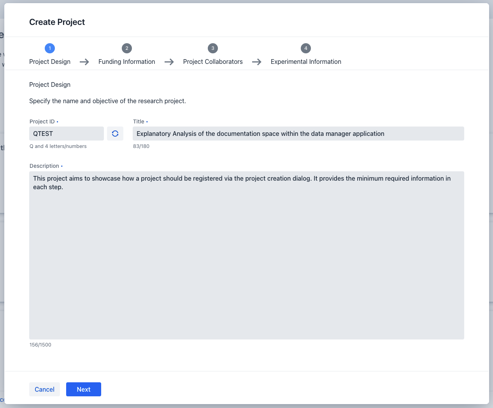
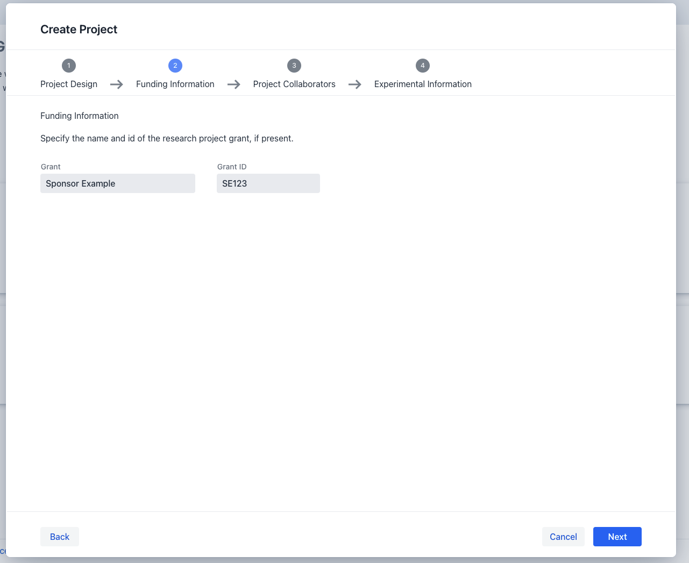
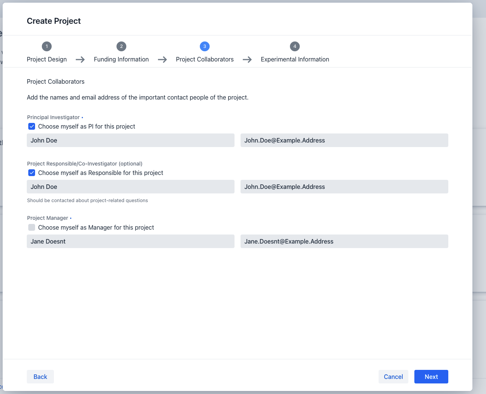
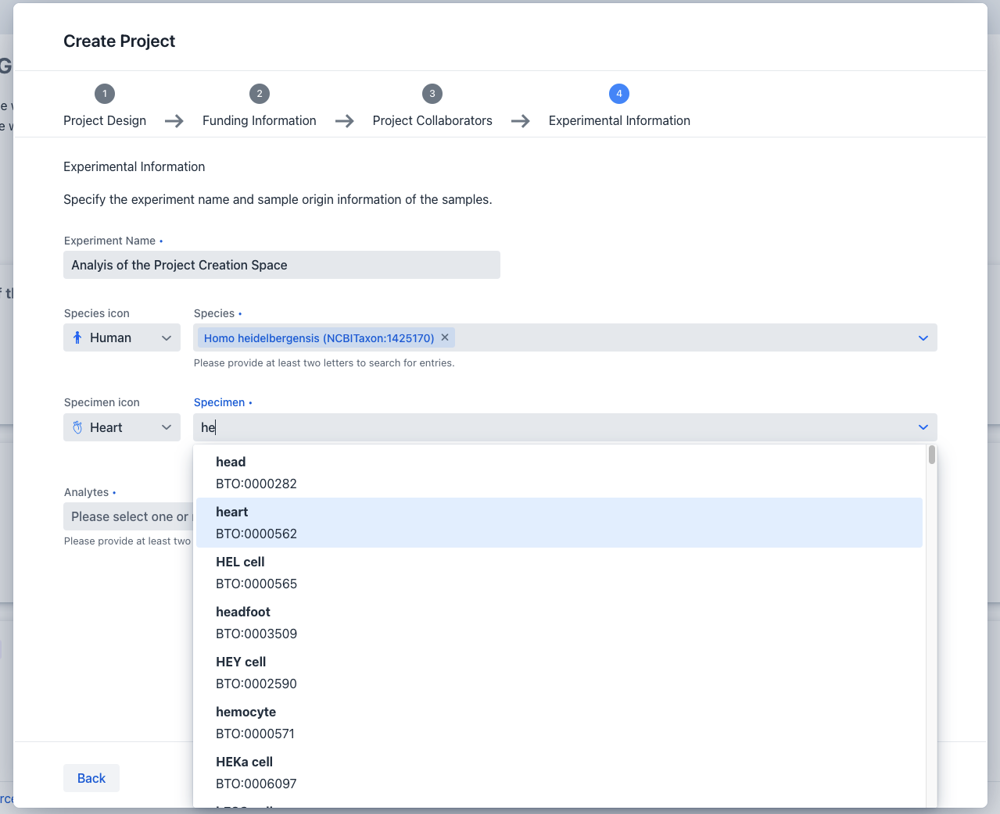
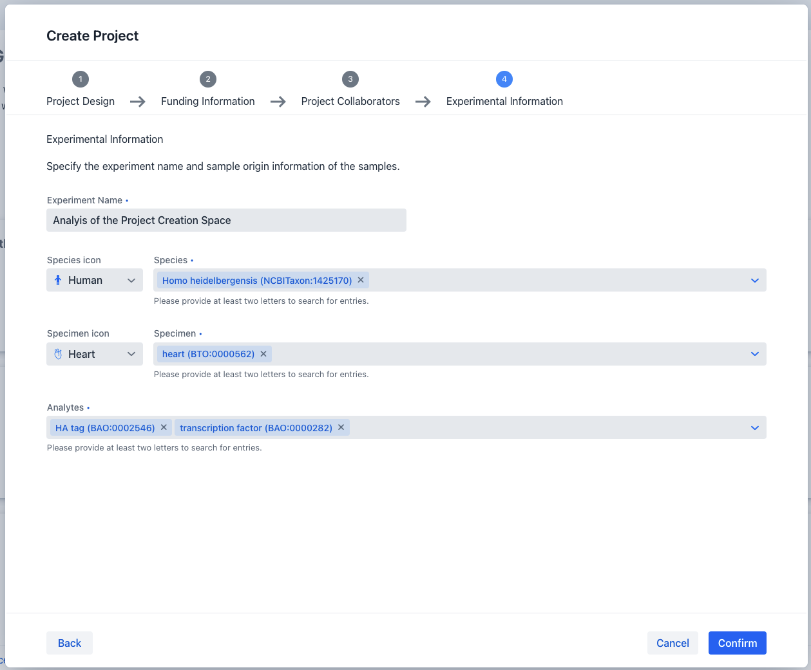

# Register a project

The registration wizard walks you through four steps. Click **Create project** at the top of your project list to begin.

## Project design

Provide a **project title** and **objective** (up to 2,000 characters).

!!! info "Project code"
    Each project is assigned a unique six-character alphanumeric code (e.g. `Q2ABCD`). This code appears in every sample ID and measurement ID downstream — treat it as your project's permanent address.

Click **Next**.

{.screenshot}

## Funding information

If your project is funded, enter the **grant name** (e.g. DFG) and **grant identifier**. Both fields are optional. Click **Next** to continue, or **Back** to revise.

{.screenshot}

## Project collaborators

| Role | Required | Description |
|---|---|---|
| **Principal investigator** | ✅ | Lead researcher |
| **Project manager** | ✅ | Day-to-day coordinator |
| **Responsible person** | ⬜ | Contact for questions |

For each role, enter a full name and email. Tick the checkbox above a role to assign yourself. Click **Next**.

{.screenshot}

## Experimental information

Set up your first experiment. Provide an **experiment name** and select at least one entry for:

- **Species** — the organism(s) your samples come from
- **Specimen** — the tissue or material type
- **Analyte** — the molecular class being measured

!!! tip "Searching for terms"
    Type at least 2 characters to see matching terms. See the [ontology search guide](../ontology_search/ontology_search_introduction.md) for details.

{.screenshot}

!!! info "What are these codes?"
    Each option is backed by a standardised identifier called a CURIE (e.g. `NCBITaxon:9606` for *Homo sapiens*). You don't need to memorise them — just search by name. The system stores the code automatically, which means your data can be understood and compared by anyone, anywhere.

Optionally select an icon for the species and specimen. Click **Confirm** to create the project.

{.screenshot}

Your project appears in the project list. You can now [upload supporting files](project_edit.md#upload-project-related-files) like offers and QC reports.

!!! note "Inviting collaborators"
    You can [add team members to this project](project_access.md) at any time — you don't need to do this before setting up your experiment.

---

## What's next

➡ [Design your experiment](../experiment/experiment_creation.md)
