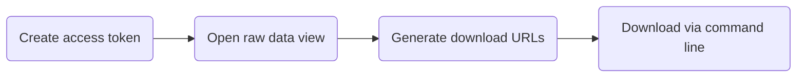
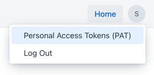
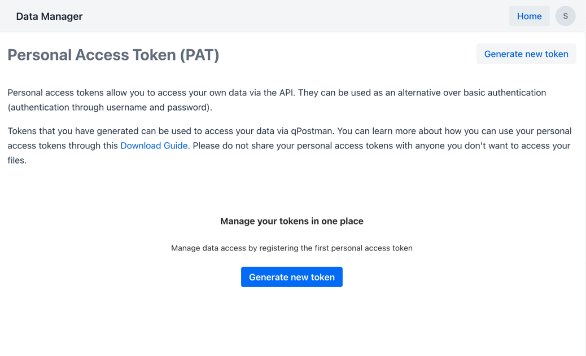
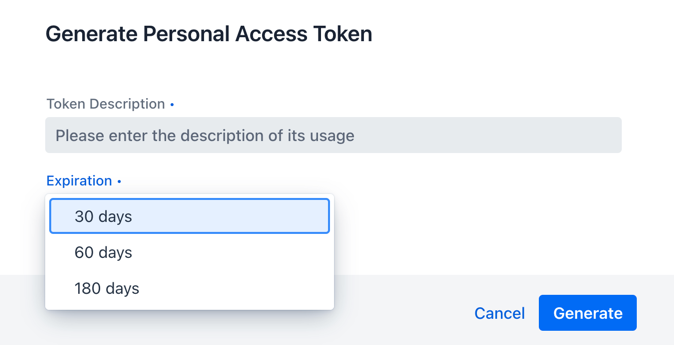
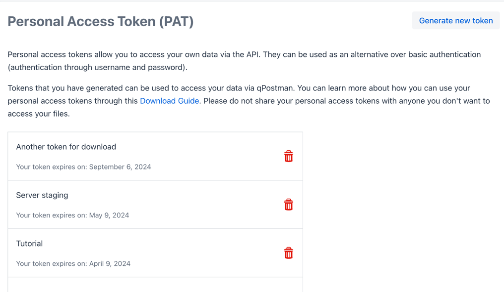
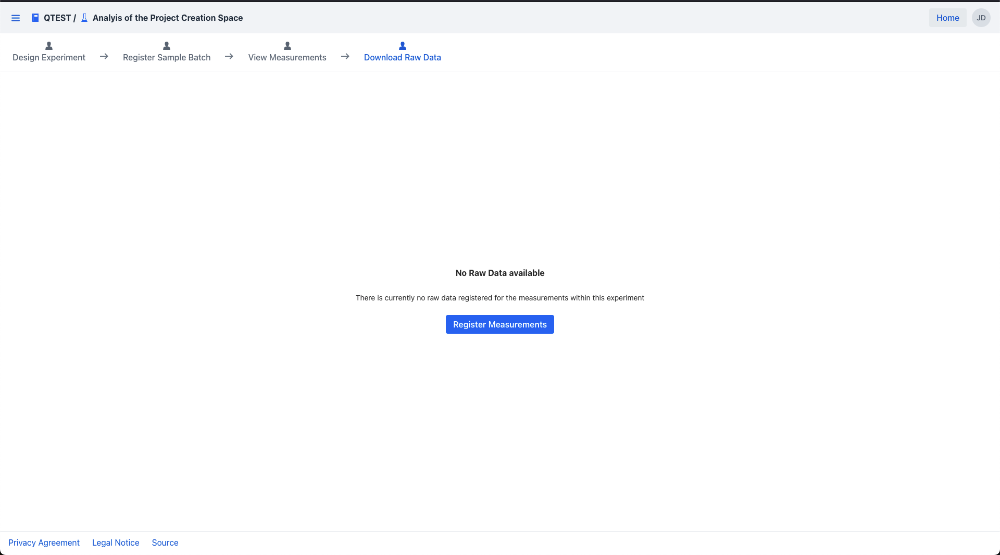
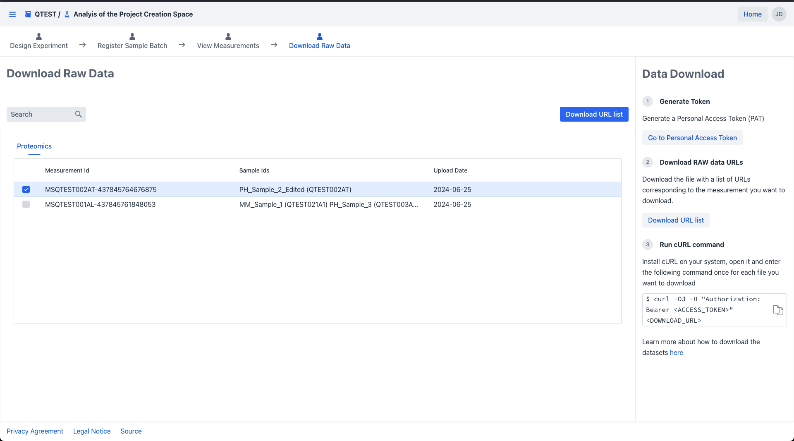
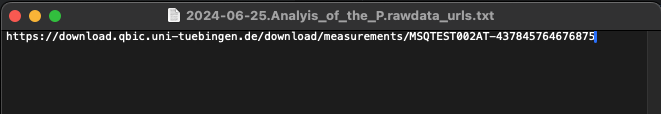
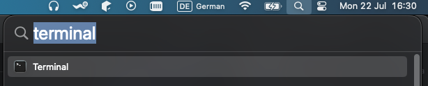
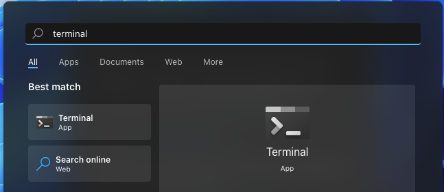

# Download raw data

The raw data view shows data already uploaded for measurements in your experiment. From here you can generate download URLs and retrieve files via the command line.

!!! info "Looking for the API?"
    See the [API reference](../developers/api.md) for programmatic access.

## Process


```mermaid
graph LR
    A(Create access token) --> B(Open raw data view)
    B --> C(Generate download URLs)
    C --> D(Download via command line)
```

## Personal access token

Before downloading, you need a personal access token (PAT) — a credential that identifies you to the download server without exposing your password.

!!! danger "Keep your token secret"
    Treat your PAT like a password. Don't paste it into shared scripts, don't commit it to version control, and don't share it with colleagues. Each person should generate their own token.

### Generate a token

1. Click your profile icon (top right) and open the PAT overview page.

    {.screenshot}

    {.screenshot}

2. Set an expiry date and click **Generate**.

    {.screenshot}

    !!! warning "One-time visibility"
        The token is shown in full only once. Copy it to a password manager immediately — you won't be able to see it again.

### Manage tokens

Your created tokens appear in the overview. Descriptions help you remember what each token is for.

{.screenshot}

!!! danger "Compromised token?"
    If a token may have been exposed, delete it immediately and create a new one.

## Raw data navigation

[Navigate](../project/project_introduction.md#find-and-open-a-project) to your project, then [open the experiment](../experiment/experiment_introduction.md#find-and-open-an-experiment). Click the **Download Raw Data** tab.

{.screenshot}

{.screenshot}

## Generate download URLs

1. Select the measurements you want to download.

    {.screenshot}

2. Click **Download URL List** to download a text file containing one URL per measurement.

    {.screenshot}

## Download via command line

You'll need a terminal to run the download commands. If you haven't used one before — don't worry. Just copy, paste, and press Enter.

=== "Open terminal on Mac"

    Click the magnifying glass (top right) or press `Cmd + Space`, type `Terminal`, and select the Terminal app.

    

=== "Open terminal on Windows"

    Click the magnifying glass in the taskbar, type `Terminal`, and select the Terminal app.

    

!!! warning "Download location"
    Files download to the directory you're currently in. Make sure it's the right folder and has enough free space.

### Single measurement

Replace `<ACCESS_TOKEN>` with your PAT and `<MEASUREMENT_URL>` with the URL from the download list.

=== "curl"

    ```bash
    curl --fail -OJ -H "Authorization: Bearer <ACCESS_TOKEN>" <MEASUREMENT_URL>
    ```

=== "wget"

    ```bash
    wget --content-disposition --trust-server-names --header "Authorization: Bearer <ACCESS_TOKEN>" <MEASUREMENT_URL>
    ```

### Multiple measurements

Create a text file with one URL per line (or use the file from the [URL generation step](#generate-download-urls)).

=== "curl"

    ```bash
    curl --fail --parallel --remote-name-all -J -H "Authorization: Bearer <ACCESS_TOKEN>" $(cat download_urls.txt)
    ```

    !!! note "curl version"
        The `--parallel` flag requires curl 7.66.0 or later. Check with `curl --version`. On macOS, install a current version via Homebrew if needed: `brew install curl`.

=== "wget"

    ```bash
    wget --content-disposition --trust-server-names --header "Authorization: Bearer <ACCESS_TOKEN>" -i download_urls.txt
    ```

!!! warning "File encoding"
    The URL text file must be UTF-8 encoded.

---

## What's next

➡ [Manage project access](../project/project_access.md)
