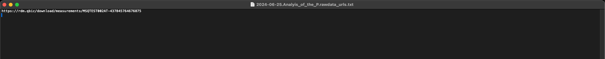

# Raw Data URL Generation

To acquire the URLS necessary for measurement download the following steps have to be taken:

1. Navigate to the [raw data summary view](raw_data_download_introduction.md#raw-data-navigation)
2. Select the measurements for which the raw data URLS should be generated.

3. Press the "Generate URL List" button to download a text file containing the URLs of the selected measurements

