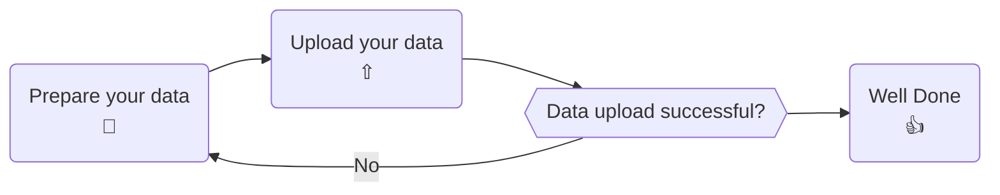

# Upload Data

After creating measurements in the data manager, you can upload measured data to our platform.
This section gives an overview of how to upload data to measurements from QBiC's data manager.

## Prerequisites

The following is required in order to successfully execute the measurement data upload.

- Access to the project of interest
- A SFTP **client** software (e.g. [FileZilla](https://filezilla-project.org/download.php?type=client)
  or [WinSCP](https://winscp.net))
- A LDAP account of the University Of Tübingen
- A connection to the University Of Tübingen network (
  e.g. [using the University VPN](https://uni-tuebingen.de/en/facilities/zentrum-fuer-datenverarbeitung/services/network-services/network-access/remote-access-vpn/))

## Process Overview



## Connect to the SFTP server

Uploading your files to us was never this easy! SFTP is a broadly used file transfer protocol. The
wide-spread use ensures that there exists many client software products that
support uploading files to us.
In this section we will go through the process of connecting to our server
using the [FileZilla](https://filezilla-project.org/download.php?type=client) client as an example.

**Open the Site Manager:** You need to add the QBiC's upload server as a site to _FileZilla_ within its site manager.
To open the site manager select it from the menu or press on the highlighted icon.


**Add the upload server:** In the _Site Manager_ you can add sites to which you want to connect. For
measurement data registration, select `SFTP - SSH File Transfer Protocol` and
enter `upload.qbic.uni-tuebingen.de` into the `Host` field.


You can log in with your _University of Tübingen_ credentials. Enter your university user account
into the `User` field.

**Connect to the server:** Make sure you are in the network of the _University of Tübingen_. You can connect to the server by pressing `Connect` in
the _Site Manager_. After connecting to the server, _FileZilla_ shows you the contents of your home directory on the server side.

!!! warning
    When you first log in, the server will create some folders. Do not delete these folders!

## Prepare your data for upload

You need to prepare your data for us to know to which measurement to attach it. Uploading data to a
measurement is called data registration in the following section.
Folders with a given structure that are moved into the `registration` folder, are automatically
registered in our system.
For every registration task, the data needs to reside in a folder with the following structure:

```text
|- my-registration-batch  // folder name is irrelevant
 |- metadata.txt  // mandatory!
 |- file1_1.fastq.gz // all files except for metadata.txt serve as examples
 |- file1_2.fastq
 |- report.pdf
 |- summary.html
```


!!! warning
    Ensure that the uploaded folder name and files do not have a whitespace within their name

You can upload folders in the same way. Everything at the top level of your created folder is
considered. For uploading folders, specify the name of the folder instead of a file name. 
Uploading only specific files from a subdirectory is not supported at the moment.

To register a folder the data needs to reside in a folder with the following structure:

```text
|- upload-example  // folder name is irrelevant
 |- metadata.txt  // mandatory!
 |- my-registration-batch/
```

The `metadata.txt` file for the folder example would look like this: 

```text
NGSQTN23015AS-1225978199074484 my-registration-batch
```

The folder `my-registration-batch` represents an atomic registration unit and must contain the
`metadata.txt` with information about the measurements identifier and the files belonging to this
measurement dataset.
One registration task can register data for multiple measurements. The `metadata.txt` file for the
previous example would look like this:

```text
NGSQTN23015AS-1225978199074484  file1_1.fastq.gz
NGSQTN23015AS-1225978199074484  file1_2.fastq
NGSQTN23015AS-1225978199074484  report.pdf
NGSQTN23015AS-1225978199074484  summary.html
```

!!! note
    Ensure that measurement identifier and filename are separated by a TAB `\t` character and not
    by spaces.

## Upload your data

Once you have prepared your folder, upload it to your user directory on our server. Please do not
upload directly to the registration folder but stage it instead in your user directory.
Once your folder is prepared and uploaded to `upload.qbic.uni-tuebingen.de`, move it to
the `registration` folder.

!!! tip
    You can easily drag and drop the folder via your mouse 
    from your local filesystem to our server within filezilla

Our system will then transfer the folder and proceed with data registration.

!!! success
    Congratulations you have uploaded your data!

Finally, you can view summarized information for your uploaded data within the raw data view of the data manager.


## Handle failed uploads

Uploading data to a measurement can fail in certain cases. When an upload fails, a folder is created
in  `/home/<your-user>/error`.

In this new folder, you can find an `error.txt` file describing the error, and the data you tried to upload.
You can then try to fix the error. To retry the upload of the fixed folder, move it to the registration folder again.
