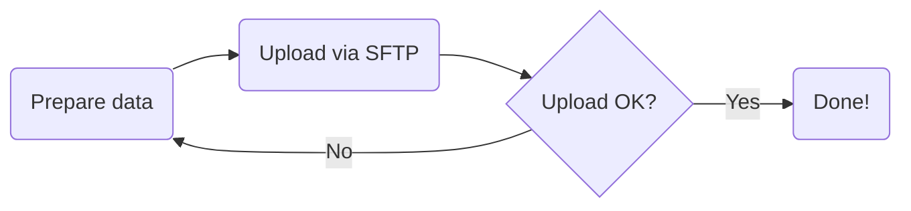
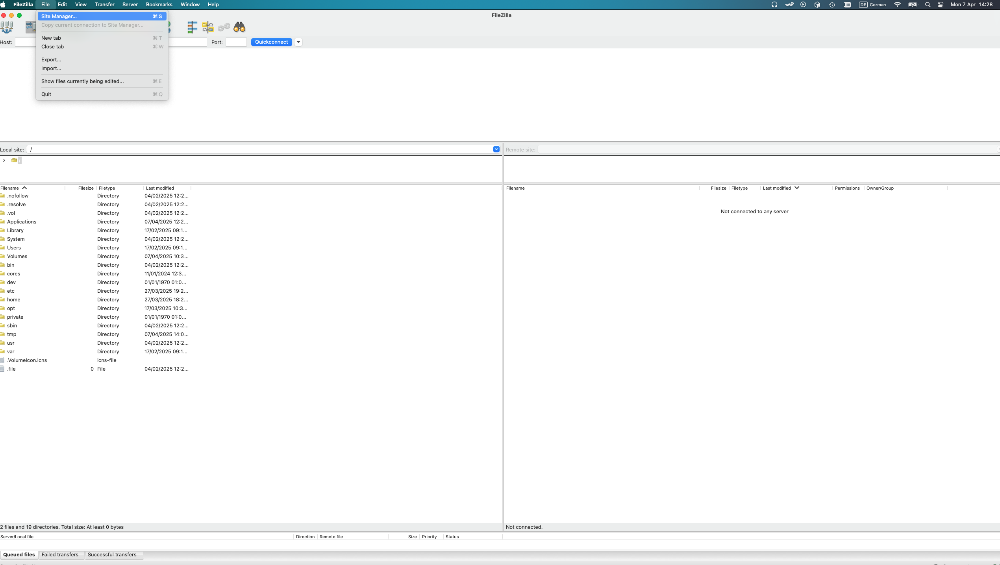
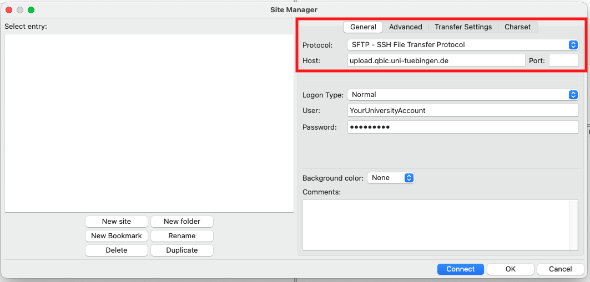
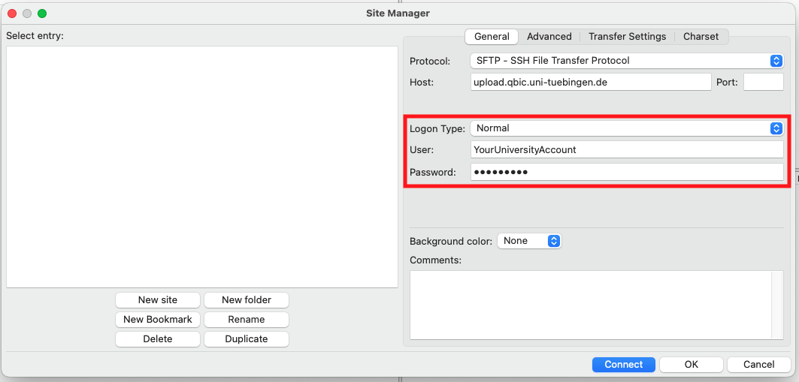
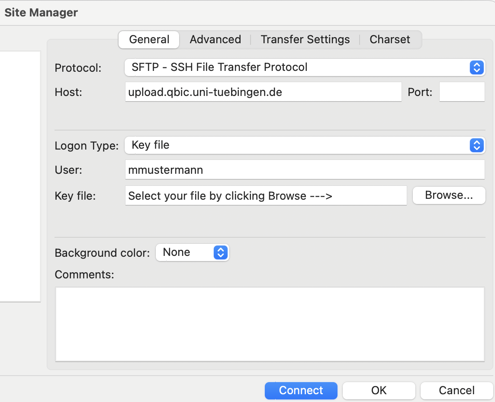
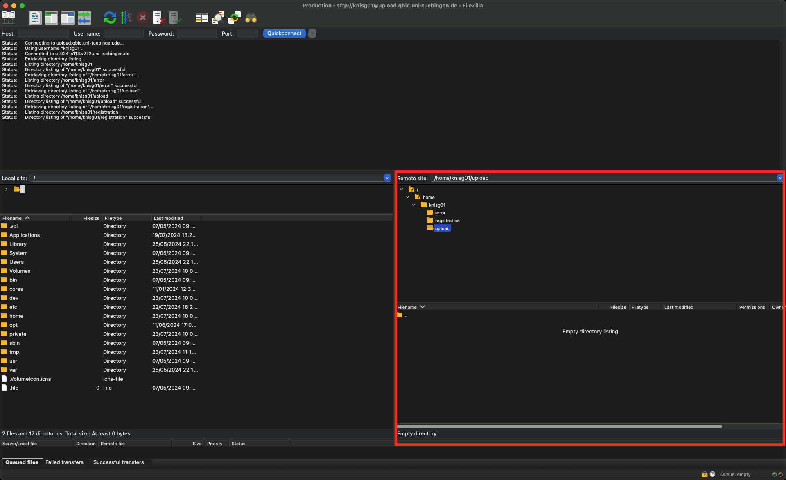
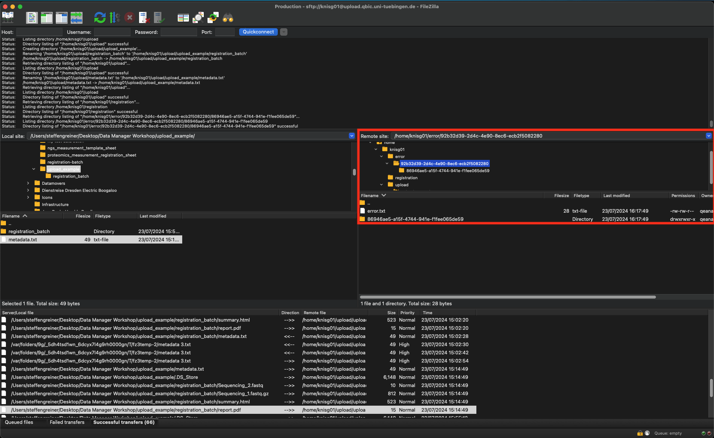

# Upload raw data

After registering measurements, upload your instrument output files to the QBiC platform via SFTP.

!!! info "External collaborators"
    Not at the University of Tübingen? [Request server access](raw_data_request_server_access.md) first.

## Prerequisites

=== "University of Tübingen member"

    - VPN connection to the university network ([setup guide](https://uni-tuebingen.de/en/facilities/zentrum-fuer-datenverarbeitung/services/network-services/network-access/remote-access-vpn/))
    - University LDAP account
    - Project access in the Data Manager
    - SFTP client ([FileZilla](https://filezilla-project.org/download.php?type=client) or [WinSCP](https://winscp.net)) or the OpenSSH `sftp` command

=== "External data submitter"

    - [Approved server access](raw_data_request_server_access.md)
    - Project access in the Data Manager
    - SFTP client or OpenSSH `sftp` command

## Process overview


```mermaid
graph LR
    A(Prepare data) --> B(Upload via SFTP)
    B --> C{Upload OK?}
    C -- No --> A
    C -- Yes --> D(Done!)
```

## Prepare your data

Each upload needs a folder containing a `metadata.txt` file that maps files to measurement IDs. This file is what links your raw data to the correct measurement record.

!!! warning "No spaces in names"
    Folder names and file names must not contain spaces.

### Single measurement

```text
upload-example/
├── metadata.txt
├── file1_R1.fastq.gz
├── file1_R2.fastq.gz
└── report.pdf
```

The `metadata.txt` maps each file to a measurement ID, separated by a **TAB character** (not spaces):

```
MSQTEST001AL-437845761848053	file1_R1.fastq.gz
MSQTEST001AL-437845761848053	file1_R2.fastq.gz
MSQTEST001AL-437845761848053	report.pdf
```

!!! warning "TAB characters required"
    The measurement ID and filename must be separated by a TAB (`\t`), not spaces. They look identical in most editors — use a plain-text editor or export to TSV from a spreadsheet.

An example file is provided [here](templates/metadata_same_measurement_example/metadata.txt). Adjust the measurement ID and filenames to match your upload.

### Multiple measurements

```text
upload-example/
├── metadata.txt
├── batch-1/
│   ├── file1_R1.fastq.gz
│   └── file1_R2.fastq.gz
└── batch-2/
    ├── file2_R1.fastq.gz
    └── file2_R2.fastq.gz
```

```
MSQTEST001AL-437845761848053	batch-1
MSQTEST002AT-437845764676875	batch-2
```

An example is provided [here](templates/metadata_multiple_measurements_example/metadata.txt).

## Upload via SFTP client

We'll use [FileZilla](https://filezilla-project.org/download.php?type=client) as an example.

### Connect to the server

1. Open the **Site Manager** in FileZilla.

    {.screenshot}

2. Add a new site with protocol **SFTP** and host `upload.qbic.uni-tuebingen.de`.

    {.screenshot}

3. Enter your credentials:

    === "University member"

        Enter your university username.

        {.screenshot}

    === "External submitter"

        Enter your username and select your private key file from your `.ssh` directory.

        {.screenshot}

4. Click **Connect**.

    {.screenshot}

    !!! warning "Don't delete the default folders"
        The server creates `registration`, `error`, and `upload` folders on first login. Do not delete them.

### Upload and register

1. Upload your prepared folder to your home directory on the server (not directly to `registration`).
2. Once the upload is complete, move the folder into the `registration` directory.

    !!! tip "Drag and drop"
        You can drag and drop between local and remote file panels in FileZilla.

3. The system processes your data automatically.

!!! success "Upload complete"
    View a summary of your uploaded data in the raw data view of the Data Manager.

If files don't appear, check the `error` directory — see [Handle failed uploads](#handle-failed-uploads).

## Upload via command line

=== "External submitter"

    ```bash
    sftp -i <your-private-key> <username>@upload.qbic.uni-tuebingen.de
    ```

=== "University member"

    ```bash
    sftp <username>@upload.qbic.uni-tuebingen.de
    ```

After connecting:

```bash
ls -l                    # list remote directory
put -r <your-dataset>    # upload your folder
rename <your-dataset> ../registration/<your-dataset>   # trigger registration
```

!!! tip "Useful SFTP commands"
    `lls` lists your local directory. `lpwd` shows your local working directory. `pwd` shows the remote directory.

## Handle failed uploads

If an upload fails, a folder appears in `/home/<your-user>/error` containing an `error.txt` file and your data.

{.screenshot}

Fix the error described in `error.txt`, then move the folder back to `registration` to retry.

!!! tip "Share with collaborators"
    Grant your team [project access](../project/project_access.md) so they can download files directly.

---

## What's next

➡ [Download raw data](raw_data_download.md)
