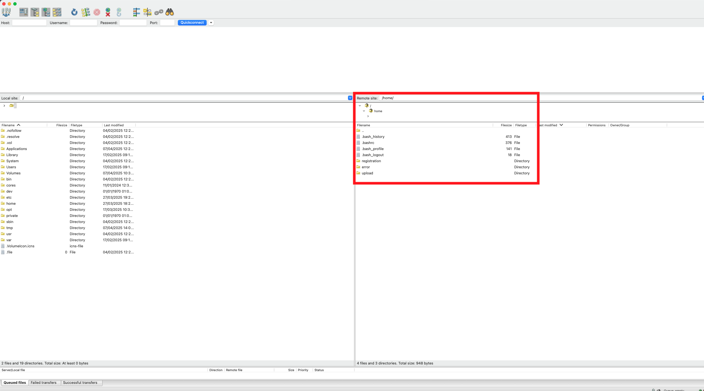

# Upload Data

After creating measurements in the data manager, you can upload measured data to our platform.
This section gives an overview on how to upload data to measurements from QBiC's data manager.

## Prerequisites

The following is required in order to successfully execute the measurement data upload.

- A connection to the University Of Tübingen network (
  e.g. [using the University VPN](https://uni-tuebingen.de/en/facilities/zentrum-fuer-datenverarbeitung/services/network-services/network-access/remote-access-vpn/))
- An LDAP account of the University Of Tübingen
- Access to the project of interest
- OpenSSH package or a SFTP **client** software (e.g. [FileZilla](https://filezilla-project.org/download.php?type=client)
  or [WinSCP](https://winscp.net))

## Process Overview

```mermaid
graph LR
  A(Prepare your data 
  📝) --> B(Upload your data
  ⇧)
  B --> D{{Data upload successful?}}
  D -- No --> A
  D --> F("Well Done 
  👍")
```



## Prepare your datasets for upload

You need to prepare your datasets for us to know to which measurement to attach it. 
Uploading data to a measurement is called data registration in the following section.
Folders with a given structure that are moved into the `registration` folder, are automatically
registered in our system.

### Prepare dataset upload to a singular measurement

For every registration task, the data needs to reside in a distinct folder containing a `metadata.txt` file:

```text
|- upload-example  // folder name is irrelevant
 |- metadata.txt  // mandatory!
 |- file1_1.fastq.gz // all files except for metadata.txt serve as examples
 |- file1_2.fastq
 |- report.pdf
 |- summary.html
```

!!! warning
    Ensure that the uploaded folder name and files do not have a whitespace within their name

The `metadata.txt` file for such an example would look like this:

```bash
MSQTEST001AL-437845761848053  file1_1.fastq.gz
MSQTEST001AL-437845761848053  file1_2.fastq
MSQTEST001AL-437845761848053  report.pdf
MSQTEST001AL-437845761848053  summary.html
```

The example metadata file is provided [here](templates/metadata_same_measurement_example/metadata.txt), 
please keep in mind you need to adjust the measurementId and filenames to your specific upload.

!!! note
    Ensure that measurement identifier and filename are separated by a TAB `\t` character and not
    by spaces.


### Prepare dataset upload to multiple measurements

You can upload multiple folders to distinct measurements the same way. 
Everything at the top level of your created folder is considered. 
For uploading folders, specify the name of the folders instead of a file name. 
Uploading only specific files from a subdirectory is not supported at the moment.

To register folders the data needs to reside within an outer folder with the following structure:

```text
|- upload-example  // folder name is irrelevant
 |- metadata.txt  // mandatory!
 |- my-registration-batch/
   |-- file1_1.fastq.gz
   |-- file1_2.fastq.gz
 |- my-registration-batch2/
   |-- file1_1.fastq.gz
   |-- file1_2.fastq.gz
```

!!! warning
    Ensure that the uploaded folder name and files do not have a whitespace within their name

The folder `upload-example` represents an atomic registration unit and must contain the `metadata.txt` 
with information about the measurements identifiers and the folder names to be registered
Basically this means one upload can trigger multiple registrations to distinct measurements. 
The `metadata.txt` file for such an example would look like this:

```bash
MSQTEST001AL-437845761848053  my-registration-batch
MSQTEST002AT-437845764676875  my-registration-batch2
```

The example metadata file is provided [here](templates/metadata_multiple_measurements_example/metadata.txt), 
please keep in mind you need to adjust the measurement Ids and dataset names as outlined in this section.

!!! note
    Ensure that measurement identifier and filename are separated by a TAB `\t` character and not
    by spaces.

## Upload your dataset via SFTP Client

Uploading your files to us was never this easy! SFTP is a broadly used file transfer protocol. The
wide-spread use ensures that there exists many client software products that
support uploading files to us.
In this section we will go through the process of connecting to our server
using the [FileZilla](https://filezilla-project.org/download.php?type=client) client as an example.

### Install SFTP client
Filezilla provides an up-to-date [documentation](https://wiki.filezilla-project.org/Client_Installation) 
on the installation process for each operating system.
We recommend to get in contact with your local IT department should you need assistance or have 
chosen a different SFTP client.

### Connect and upload your dataset

**Open the Site Manager:** You need to add the QBiC's upload server as a site to _FileZilla_ within its site manager.
To open the site manager select it from the menu or press on the highlighted icon.


**Add the upload server:** In the _Site Manager_ you can add sites to which you want to connect. For
measurement data registration, select `SFTP - SSH File Transfer Protocol` and
enter `upload.qbic.uni-tuebingen.de` into the `Host` field.


You can log in with your _University of Tübingen_ credentials. Enter your university user account
into the `User` field.

**Connect to the server:** Make sure you are in the network of the _University of Tübingen_. You can connect to the server by pressing `Connect` in
the _Site Manager_. After connecting to the server, _FileZilla_ shows you the contents of your home directory on the server side.

!!! warning
    When you first log in, the server will create some folders. Do not delete these folders!

Once you have prepared your folder, upload it to your user directory on our server. Please do not
upload directly to the registration folder but stage it instead in your user directory.
Once your folder is prepared and uploaded to `upload.qbic.uni-tuebingen.de`, move it to
the `registration` folder.

!!! tip
    You can easily drag and drop the folder via your mouse
    from your local filesystem to our server within filezilla

Our system will then transfer the folder and proceed with data registration.

!!! success
    Congratulations you have uploaded your data!

Finally, you can view summarized information for your uploaded data within the raw data view of the data manager.


Should your files not appear check the error directory as outlined in the [failed upload section](#handle-failed-uploads)

## Upload your dataset via command line

The OpenSSH SFTP program is supported natively by most operating systems.
In this section we will go through the process of connecting to our server
using the [OpenSSH SFTP](https://man.openbsd.org/sftp) program.

### Install OpenSSH SFTP

#### Linux/Mac
Linux and Mac systems do typically have the OpenSSH package containing SFTP pre-installed.
Should this not be the case, try to install the openSSH package with the package manager employed by your system.
We recommend to get in contact with your local IT department should you need assistance.

#### Windows
Newer Windows Versions (Windows10 version 1803 and newer and Windows 11) do typically have the OpenSSH package containing SFTP preinstalled.
Should this not be the case, check your system settings to see if the **OpenSSH server feature** is installed within the windows optional features. 
We recommend to get in contact with your local IT department should you need assistance.

### Connect and upload your dataset 

!!! note
    This section requires basic command line knowledge of your operating system. 
    Check the OpenSSH sftp [manpage](https://man.openbsd.org/sftp) for information on how to use the sftp program.

Start by opening the command line within your operating system of choice. 
Next navigate to the directory containing the dataset you wish to upload.
From within this directory connect to our upload server with the **sftp** command, replacing <your-user> with your ZDV credentials:

``` bash
sftp <your-user>@upload.qbic.uni-tuebingen.de
```
Upon successful connection you will be prompted for your ZDV password.


!!! Warning
    Keep in mind that you need to be within the university network and 
    have a valid ZDV account to connect to our upload server 

If everything goes well, you'll be connected to your home directory within our upload server.
You can check out the directory structure of your home directory with the following **ls** command:

``` bash
ls -ll
```


From there navigate to the **Upload** folder within your home directory via the **cd** command:

``` bash
cd upload
```

and upload your prepared dataset from your local file system with the **put** command, replacing the `<your-dataset>` 
with the directory name of your dataset:

``` bash
put -r <your-dataset>
```


After your dataset has been successfully uploaded, you can move it to the **registration** folder via the **rename** command, 
replacing the `<your-dataset>` with the folder name of your dataset:

``` bash
rename <your-dataset> ../registration/<your-dataset>
```


Our system will then transfer the folder and proceed with data registration.

!!! success
    Congratulations you have uploaded your data!

Finally, you can view summarized information for your uploaded dataset within the raw data view of the data manager.


Should your files not appear check the error directory as outlined in the [failed upload section](#handle-failed-uploads)

## Handle failed uploads

Uploading data to a measurement can fail in certain cases. When an upload fails, a folder is created
in  `/home/<your-user>/error`.

In this new folder, you can find an `error.txt` file describing the error, and the data you tried to upload.
You can then try to fix the error. To retry the upload of the fixed folder, move it to the registration folder again.
