# Upload measurement data

This section gives an overview of how to upload data to measurements from QBiC's data manager.

## Prerequisites

- Access to the project of interest
- A SFTP client software (e.g. [FileZilla](https://filezilla-project.org) or [WinSCP](https://winscp.net))
- A LDAP account of the University Of Tübingen
- A connection to the University Of Tübingen network (e.g. [using the University VPN](https://uni-tuebingen.de/en/facilities/zentrum-fuer-datenverarbeitung/services/network-services/network-access/remote-access-vpn/))

## Process Overview

```mermaid
graph LR
  A(Prepare your data 
  📝) --> B(Upload your data
  ⇧)
  B --> D{{Data upload successful?}}
  D -- No --> A
  D --> F("Well Done 
  👍")
```

[//]: # (TODO: some high level flowchart or something)

## Connect to the SFTP server

Using your SFTP client, connect to `upload.qbic.uni-tuebingen.de`.

You can log in with your university credentials. When you first log in, the server will create some folders.

[//]: # (TODO add file tree screenshot)

!!! warning
    When you first log in, the server will create some folders. Do not delete these folders!

## Prepare your data for upload

Put everything in one folder (1 upload, 1 folder)
Prepare metadata.txt, one per upload

## Upload your data

copy folder to server location

!!! info
    It is important that the move operation of any dataset in the registration folder is atomic! Otherwise, data corruption will occur. Ideally the dataset is staged into the user's home folder first (e.g. a copy operation, an upload via SFTP or SSH) and then moved into the registration folder.

[//]: # (## Handle failed uploads)
