# Upload measurement data

After creating measurements in the data manager, you can upload measured data to our platform.
This section gives an overview of how to upload data to measurements from QBiC's data manager.

## Prerequisites

The following is required in order to successfully execute the measurement data upload.

- Access to the project of interest
- A SFTP client software (e.g. [FileZilla](https://filezilla-project.org)
  or [WinSCP](https://winscp.net))
- A LDAP account of the University Of Tübingen
- A connection to the University Of Tübingen network (
  e.g. [using the University VPN](https://uni-tuebingen.de/en/facilities/zentrum-fuer-datenverarbeitung/services/network-services/network-access/remote-access-vpn/))

## Process Overview

```mermaid
graph LR
  A(Prepare your data 
  📝) --> B(Upload your data
  ⇧)
  B --> D{{Data upload successful?}}
  D -- No --> A
  D --> F("Well Done 
  👍")
```



## Connect to the SFTP server

Uploading your files to us was never this easy! SFTP is a broadly used file transfer protocol. The
wide-spread use ensures that there exists many client software products that
support uploading files to us.
In this section we will go through the process of connecting to our server
using [FileZilla](https://filezilla-project.org) as an example.

1. Open the Site Manager
2. Add a site
3. Connect to the site
4. You can see the directories

!!! warning
    When you first log in, the server will create some folders. Do not delete these folders!

## Prepare your data for upload

You need to prepare your data for us to know to which measurement to attach it. Uploading data to a
measurement is called data registration in the following section.
Folders with a given structure that are moved into the `registration` folder, are automatically
registered in our system.
For every registration task, the data needs to reside in a folder with the following structure:

```text
|- my-registration-batch  // folder name is irrelevant
 |- file1_1.fastq.gz
 |- file1_2.fastq.gz
 |- file2_1.fastq.gz
 |- file2_2.fastq.gz
 |- metadata.txt  // mandatory!
```

The folder `my-registration-batch` represents an atomic registration unit and must contain the
`metadata.txt` with information about the measurements identifier and the files belonging to this measurement
dataset.
One registration task can register data for multiple measurements. The `metadata.txt` file for the previous example would look like this:

!!! note
    Please ensure that measurement identifier and filename are separated by a TAB character and not by spaces.

```text
NGSQTEST001AE-1234512312  file1_1.fastq.gz
NGSQTEST001AE-1234512312  file1_2.fastq.gz
NGSQTEST002BC-3321314441  file2_1.fastq.gz
NGSQTEST002BC-3321314441  file2_2.fastq.gz
```

## Upload your data

Once you have prepared your folder, upload it to your user directory on our server. Please do not upload directly to the registration folder but stage it instead in your user directory.
Once your folder is prepared and uploaded to `upload.qbic.uni-tuebingen.de`, move it to the `registration` folder.

Our system will then transfer the folder and proceed with data registration.

!!! success
    Congratulations you have uploaded your data!

## Handle failed uploads

[//]: # (TODO)
