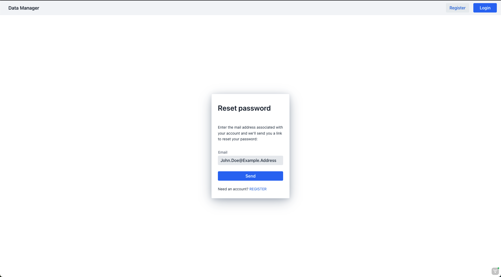

# Password Reset

The Data Manager application provides an easy and secure solution
to set a new password should a password associated with a user account be lost.
To reset your password the following steps have to be taken

1. [Provide the account credentials for which the password should be reset](#trigger-password-reset)
2. [Follow the password reset link you received in your email](#validate-the-password-reset-trigger)
3. [Set a new password for the account according to the password policy](#set-a-new-password-for-the-account)

## Trigger Password Reset

From the login page you can navigate to a dedicated password reset view via the "Forgot password"
link on the bottom of the login

You should now be able to see the password reset view:

Please provide the email address of the account for which the password should be reset
and press the "Send" button. You will receive an email with further instructions.

## Validate the Password Reset Trigger

Before the password of the provided account can be reset,
you need to validate that the account indeed belongs to you.
For this you will receive an email shortly after triggering the password reset, containing a unique
password reset link
!!! note "Spam folder"
    Please check your spam folder if you didn't receive an email

Click the URL to follow the link, which will lead you to a page which allows you to set a new
password for your account.

## Set a new password for the account

Please provide a new unique password with at least 12 characters.
Once a valid password is provided and the reset is triggered you will be redirected to a
confirmation screen upon successful reset.

From this screen you can switch to the login via the provided instructions.
