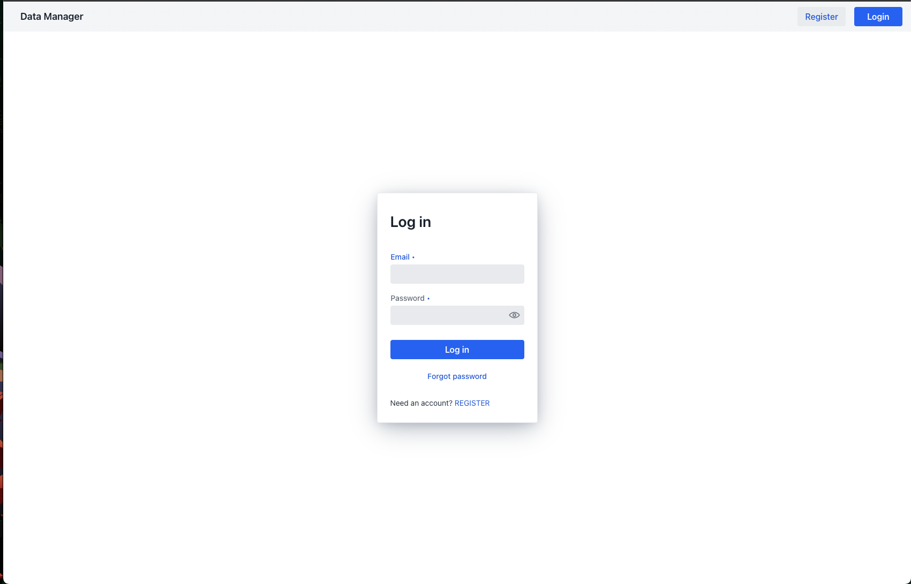
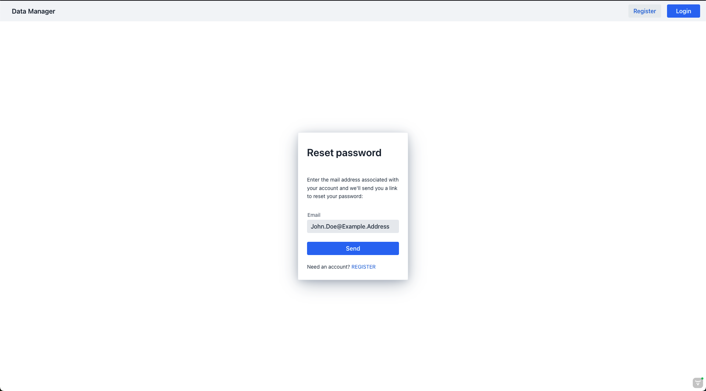
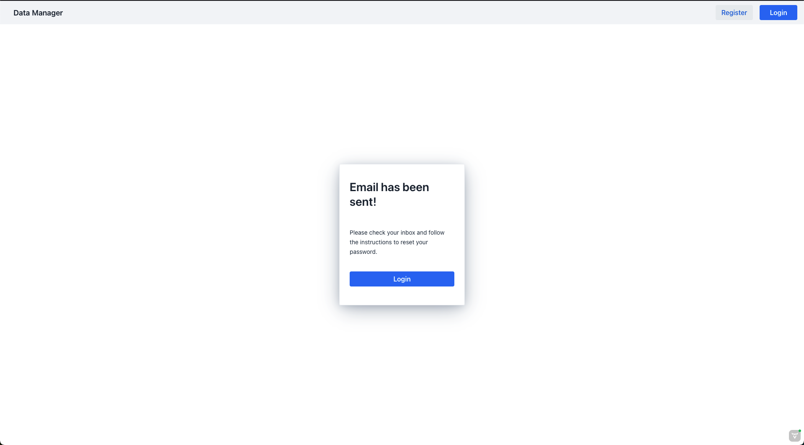
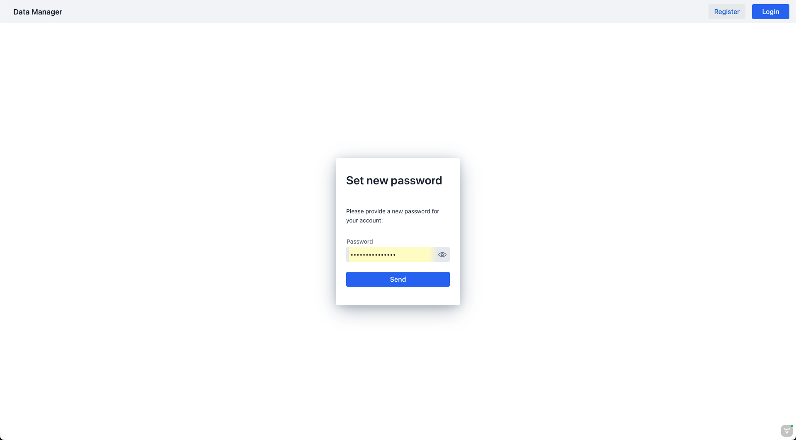
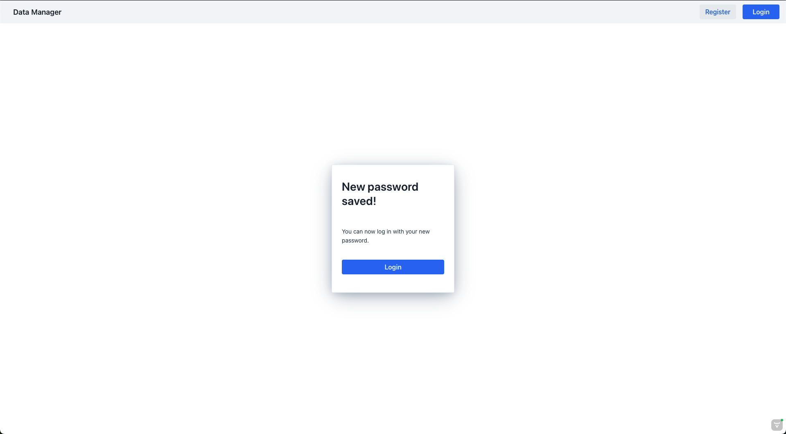

# Reset your password

Forgot your password? You can set a new one in three steps.

!!! note "ORCID users"
    If you log in via ORCID, you don't have a Data Manager password to reset. Use the ORCID login button instead.

## Step 1 — Request a reset link

1. On the [login page](https://rdm.qbic.uni-tuebingen.de/login), click **Forgot password**.

    {.screenshot}

2. Enter the email address linked to your account and click **Send**.

    {.screenshot}

    {.screenshot}

!!! note "Check your spam folder"
    If the email doesn't arrive within a few minutes, check spam or junk.

## Step 2 — Open the reset link

Click the link in the email. It takes you to a page where you can set a new password.

{.screenshot}

## Step 3 — Set a new password

Enter a new password (at least 12 characters) and confirm. Click the login link on the confirmation screen to sign in.

{.screenshot}

> Want to update your username or link your ORCID? See [Edit your profile](user_edit.md).

---

## What's next

➡ [Log in to the Data Manager](https://rdm.qbic.uni-tuebingen.de/login)
