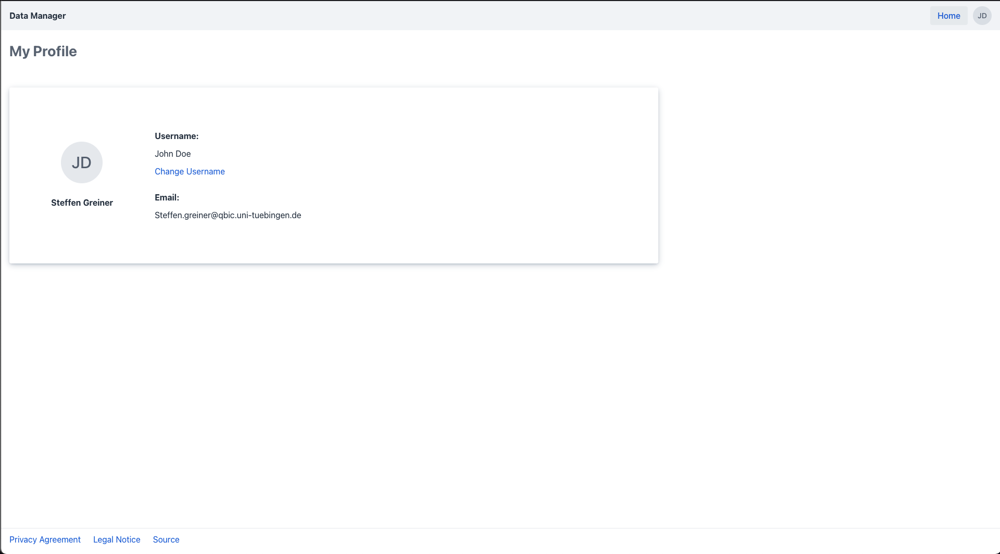

# Edit User Information

To edit your user information start by logging into the [data-manager](https://rdm.qbic.uni-tuebingen.de/login).
After login, click on your profile icon on the top right to open up the dropdown menu and select the user profile option.

This will navigate you to your personal profile page showing the information associated with your account:

1. Username
2. Profile Image
3. Full Name
4. Email Address

Within your profile you're able to change your [username](#change-user-name).

## Change User Name

Within this page, you can change your username by clicking on the blue highlighted "Change Username" text opening up the change username dialog.

!!! info "Username"
    Keep in mind that your username is unique and visible to other users within the system. 

Once you're satisfied with your new username, click the "Save" button.
The system will check if the username is unique and not already associated 
with another account and if that is the case update your username. 

