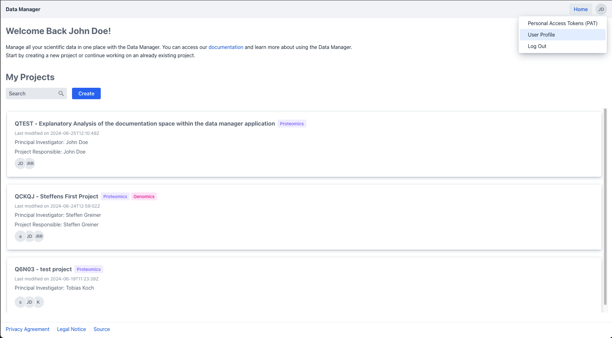
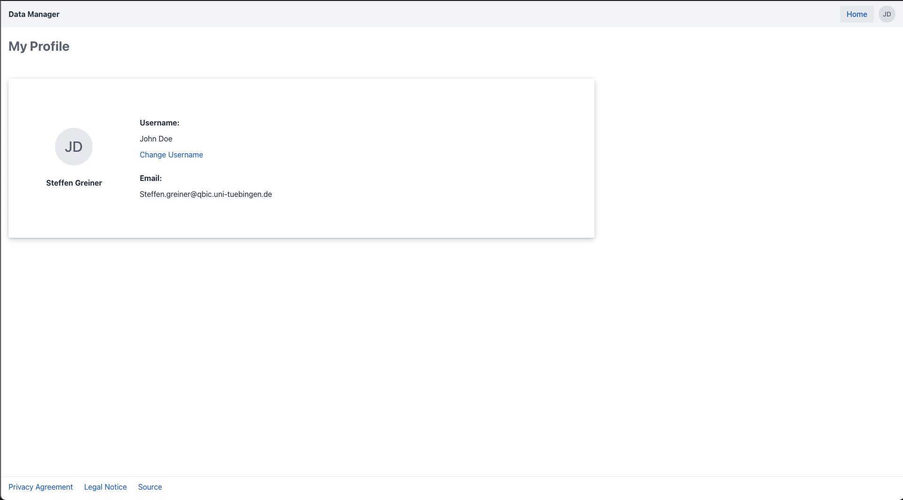
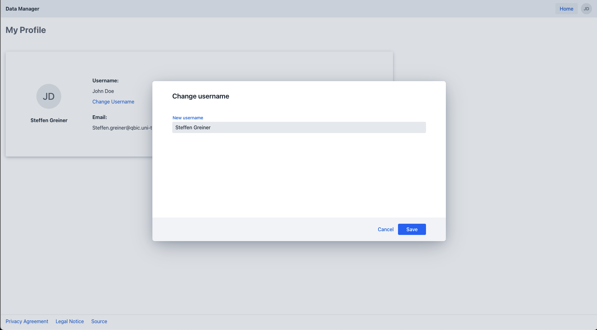
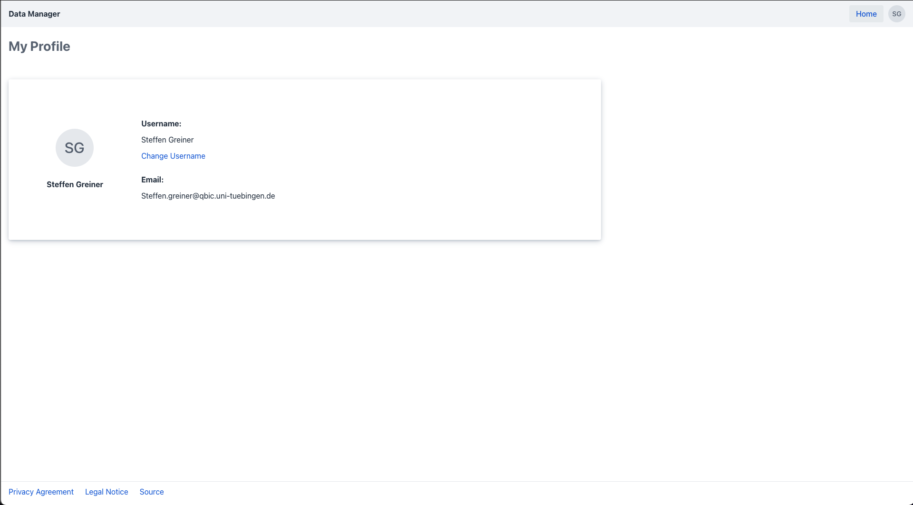
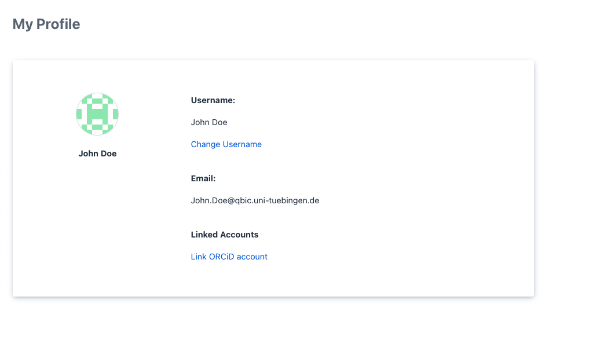
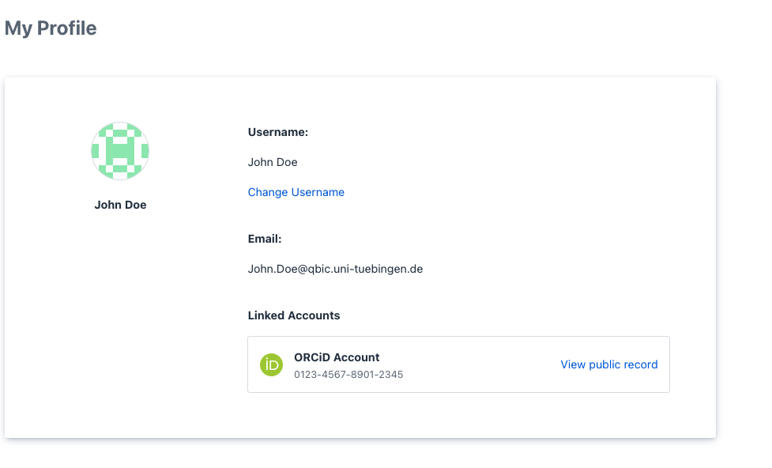

# Edit User Information

To edit your user information start by logging into the [data-manager](https://rdm.qbic.uni-tuebingen.de/login).
After login, click on your profile icon on the top right to open up the dropdown menu and select the user profile option.
{.screenshot}

This will navigate you to your personal profile page showing the information associated with your account:

1. Username
2. Profile Image
3. Full Name
4. Email Address

{.screenshot}

Within your profile you're able to change your [username](#change-user-name).

## Change User Name

Within this page, you can change your username by clicking on the blue highlighted "Change Username" text opening up the change username dialog.
{.screenshot}

!!! info "Username"
    Keep in mind that your username is unique and visible to other users within the system. 

Once you're satisfied with your new username, click the "Save" button.
The system will check if the username is unique and not already associated 
with another account and if that is the case update your username. 
{.screenshot}

## Link Orcid

Within this page, you can link your [orcid account](https://www.orcid.org) by clicking on the blue highlighted "link ORCiD account".
{.screenshot}

Clicking on "link ORCiD account" redirects you to the ORCID login page.

{.screenshot}

Login to your ORCID account and grant the Data Manager application to access your publicly available ORCID by pressing the "authorize access" button.

{.screenshot}

Should you not have an ORCID account press the "register_now" link
within the ORCID login and follow the provided steps to register a new ORCID account.

After linking your account, you can see the linked account within your profile page.

{.screenshot}
