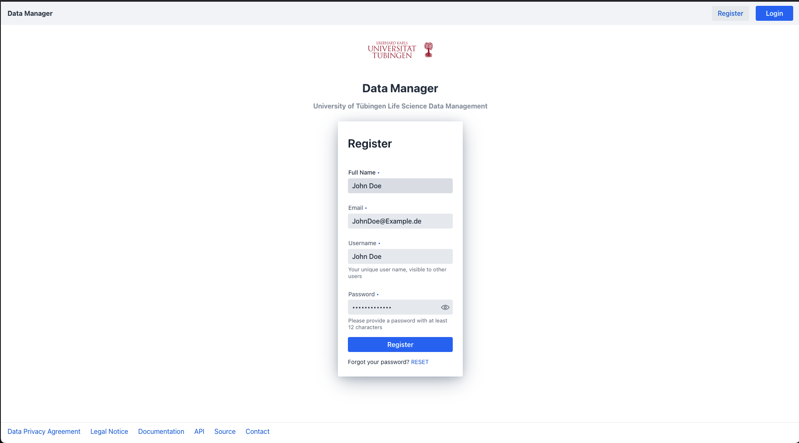
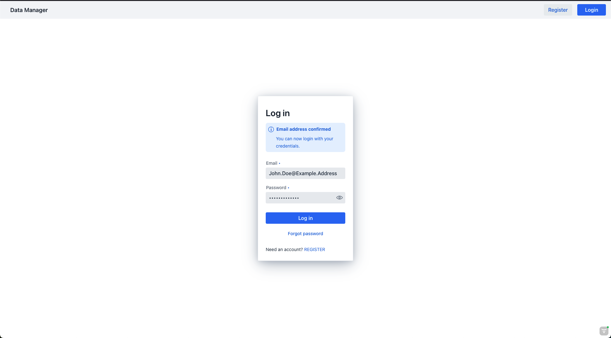
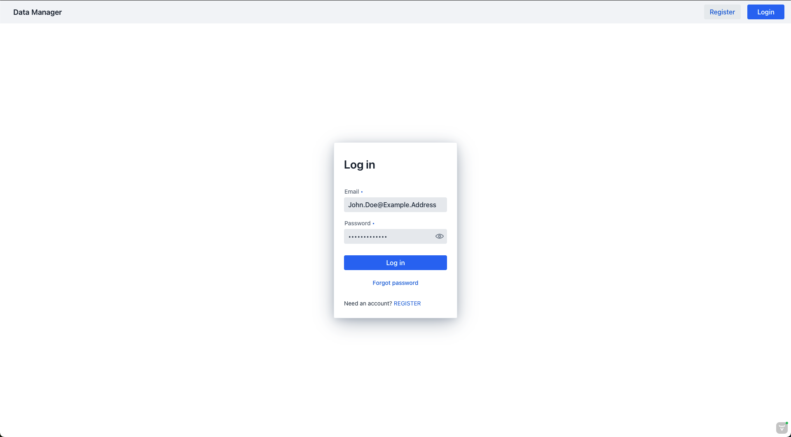

# User Registration

Before you can begin to manage your projects and access your data within the data-manager, 
you need to create an account for the platform. For this you need to perform the following steps.

1. [Register an account within the data manager](#register-account)
2. [Validate the created account via the validation link you received in your email](#validate-the-registered-account)
3. [Login into the data manager platform](#login-to-the-data-manager)

## Register Account

From the login page you can navigate to a dedicated registration site via the "registration" button on the top right 
or the registration link on the bottom of the login

You should now be able to see the registration site:

Please provide the required information which consists of: 

1. Your full name consisting of your first name and surname
2. A valid email address of choice which will be associated with your account
3. A unique username which identifies you within the data manager platform

!!! info "user name"
    This username is visible to other users within the platform

4. A secure password consisting of at least 12 characters

Once all the information has been provided correctly, 
press the register button on the bottom to create your account. 

## Validate the registered account

Before you can log into the data manager platform with your newly created account, 
you need to validate that the created account indeed belongs to the provided email address.
For this you will receive an email shortly after creating the account containing a validation link.
!!! note "spam folder"
    Please check your spam folder if you didn't receive an email

Click the link within the email, which 
will automatically validate the email address and lead you to the registration page

## Login to the data manager

After your account has been validated, you are now able to log in to the data manager. 
This can be done on the dedicated login page via the provided email address and password of the newly created account.

