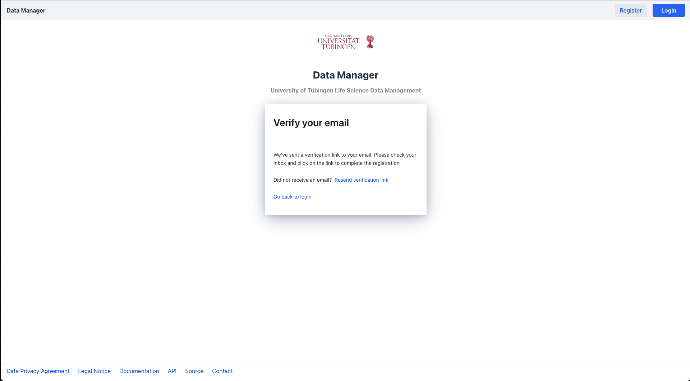

# User Registration

Before you can begin to manage your projects and access your data within the data-manager, 
you need to create an account for the platform. We currently support 2 modes of registration:

1. [Register an account via ORCID](#register-an-account-via-ORCID)
2. [Register an account via email](#register-an-account-via-email)

## Register an account via ORCID

### Login to ORCID

We recommend to register to the Data Manager via an [ORCID](https://orcid.org) account.
This will allow you to log in to the Data Manager application as long as as you keep being logged into your ORCID account, 
removing the necessity of a separate login step.
  
To do so press on the "login with ORCID" registration card on the bottom of the login page. 

{.screenshot}

This will redirect you to the ORCID login page 

{.screenshot}

Login to your ORCID account and grant the Data Manager application to access your publicly available ORCID by pressing the "authorize access" button. 

{.screenshot}

Should you not have an ORCID account press the "register_now" link 
within the ORCID login and follow the provided steps to register a new ORCID account.

### Finalize Data Manager account

If done correctly you will be redirected to the Data Manager application to finalize your account registration by providing us with additional user information.

This additional information consists of

1. Your full name consisting of your first name and surname
2. A valid email address of choice which will be associated with your Data Manager account
3. A unique username which identifies you within the Data Manager platform

!!! info "Username"
    This username is visible to other users within the platform

Press the register button to register an account within the Data Manager application and navigate to the login page.
Finally, press on the "login with ORCID" registration card on the bottom of the login page to login into the Data Manager application via your ORCID credentials. 

## Register an account via email

If you don't want to link your ORCID with the Data Manager application, 
you can also register an account with your email address by pressing the register link on the login page or via the "registration" button on the top right.

You should now be able to see the registration view:

Please provide the required information which consists of: 

1. Your full name consisting of your first name and surname
2. A valid email address of choice which will be associated with your account
3. A unique username which identifies you within the Data Manager platform

!!! info "Username"
    This username is visible to other users within the platform

4. A secure password consisting of at least 12 characters

Once all the information has been provided correctly, 
press the "register" button on the bottom to create your account. 

### Validate the registered account

Before you can log into the Data Manager platform with your newly created account, 
you need to verify the provided email address.

After creating the account, you will receive an email containing a validation link.
!!! note "Spam folder"
    Please check your spam folder if you didn't receive an email

Click the link within the email, which 
will automatically validate the email address and lead you to the registration page

### Login to the Data Manager

After your account has been verified, you are now able to log in to the Data Manager. 
This can be done on the dedicated login page via the provided email address and password of the newly created account.

