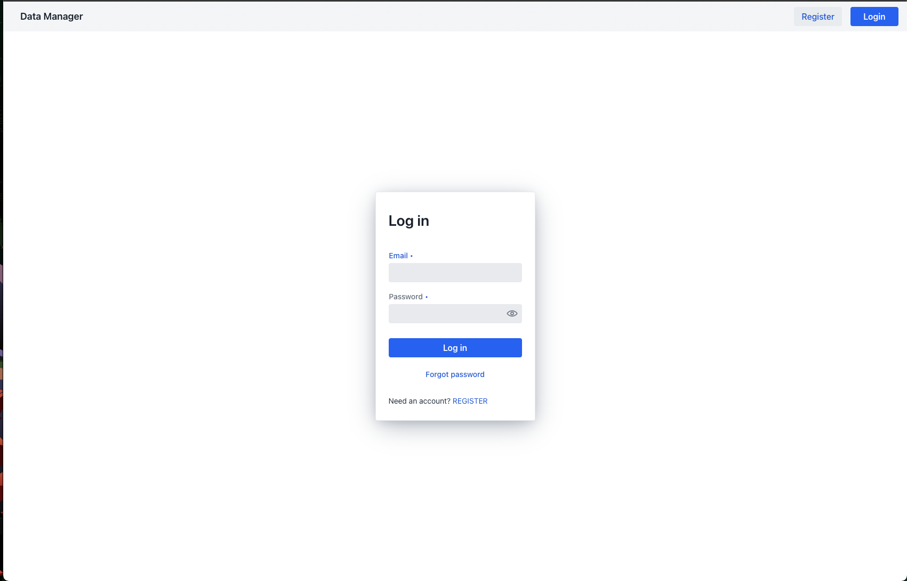
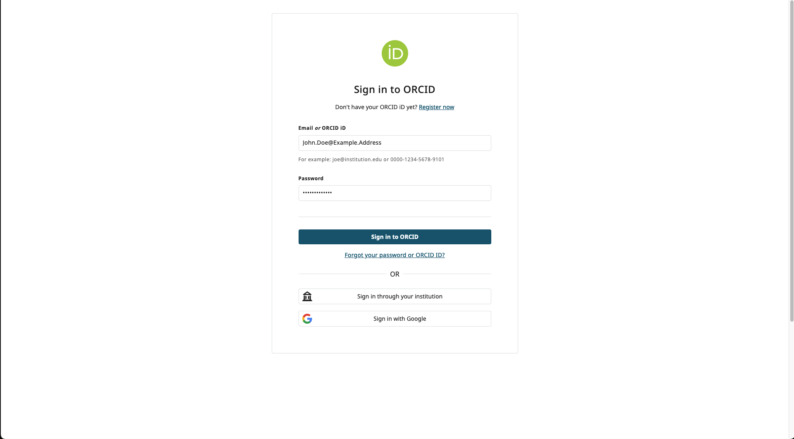
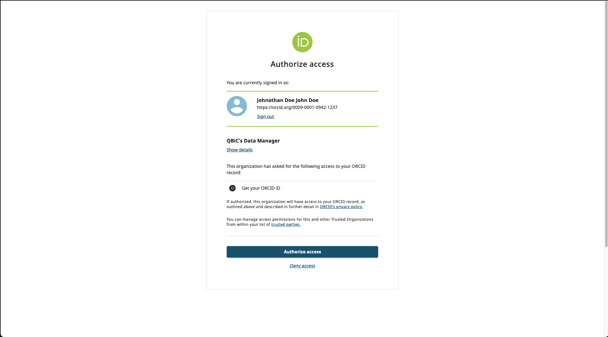
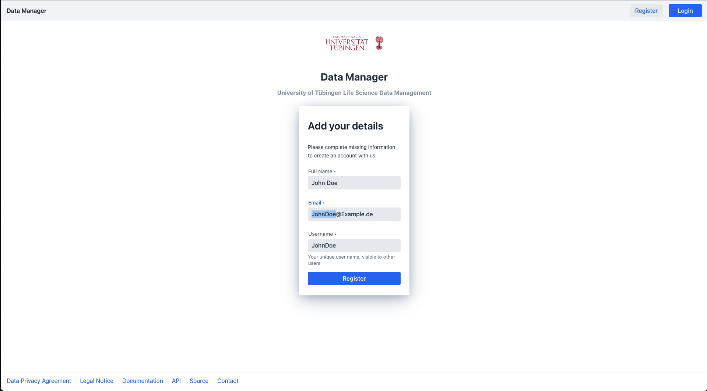
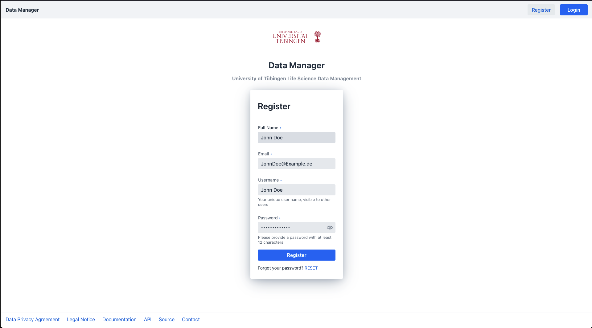
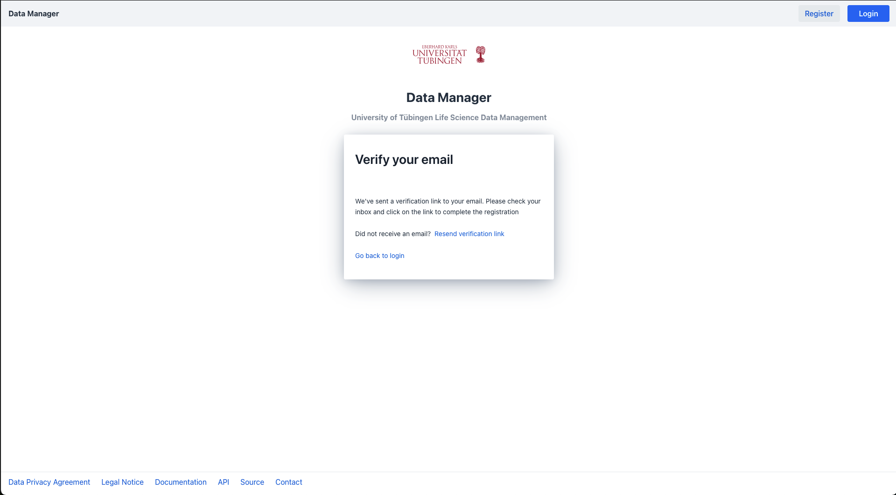
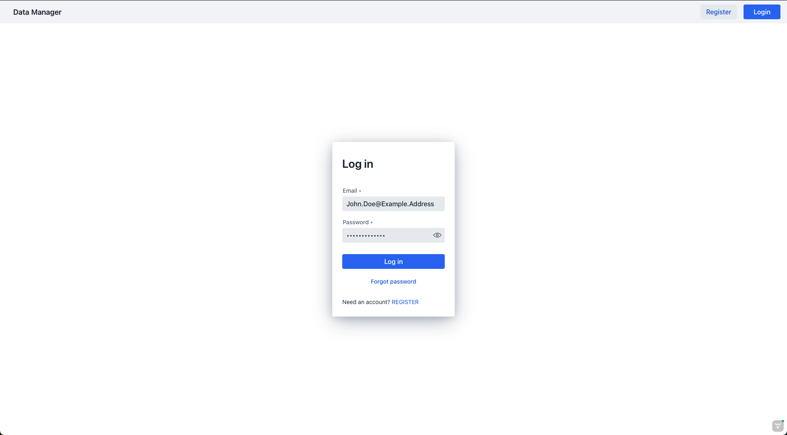

# Registration

You need a free account before you can manage projects or access data. Registration takes about two minutes.

Two options:

- [Register with ORCID](#register-with-orcid) *(recommended)*
- [Register with email](#register-with-email)

## Register with ORCID

ORCID is a free, permanent researcher identifier used by journals, funders, and institutions worldwide. Linking it lets you log in with a single click — no separate password needed.

!!! tip "No ORCID yet?"
    [Create a free account at orcid.org](https://orcid.org/register) — it takes about two minutes.

1. On the [login page](https://rdm.qbic.uni-tuebingen.de/login), click **Login with ORCID**.

    {.screenshot}

2. Sign in to your ORCID account.

    {.screenshot}

3. Click **Authorize access** to let the Data Manager read your public ORCID profile.

    {.screenshot}

4. Complete your Data Manager profile:

    - **Full name** — first name and surname
    - **Email address** — used for notifications
    - **Username** — unique, visible to other users on the platform

    {.screenshot}

5. Click **Register**, then click **Login with ORCID** on the login page to sign in.

## Register with email

1. On the [login page](https://rdm.qbic.uni-tuebingen.de/login), click **Register** (top right).

    {.screenshot}

2. Fill in the form:

    - **Full name** — first name and surname
    - **Email address** — used for login and notifications
    - **Username** — unique, visible to other users
    - **Password** — at least 12 characters

    {.screenshot}

3. Click **Register**.

### Verify your email

Before you can log in, confirm your email address by clicking the link in the verification email.

{.screenshot}

!!! note "Check your spam folder"
    If the email doesn't arrive within a few minutes, check spam or junk.

After clicking the link, you're redirected to the login page.

### Log in

Enter your email and password on the [login page](https://rdm.qbic.uni-tuebingen.de/login).

{.screenshot}

---

## What's next

➡ [Register your first project](../project/project_registration.md)
